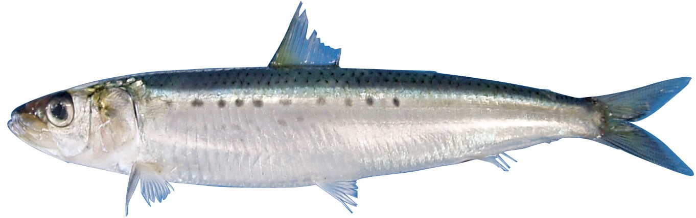
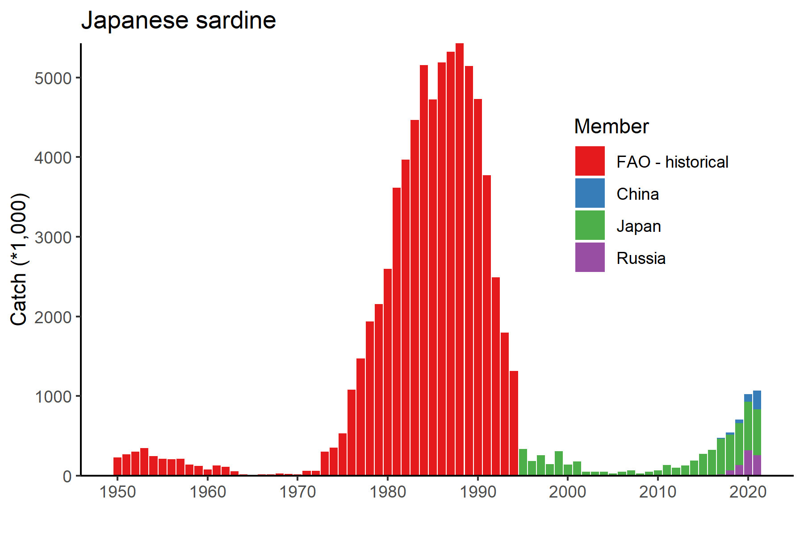
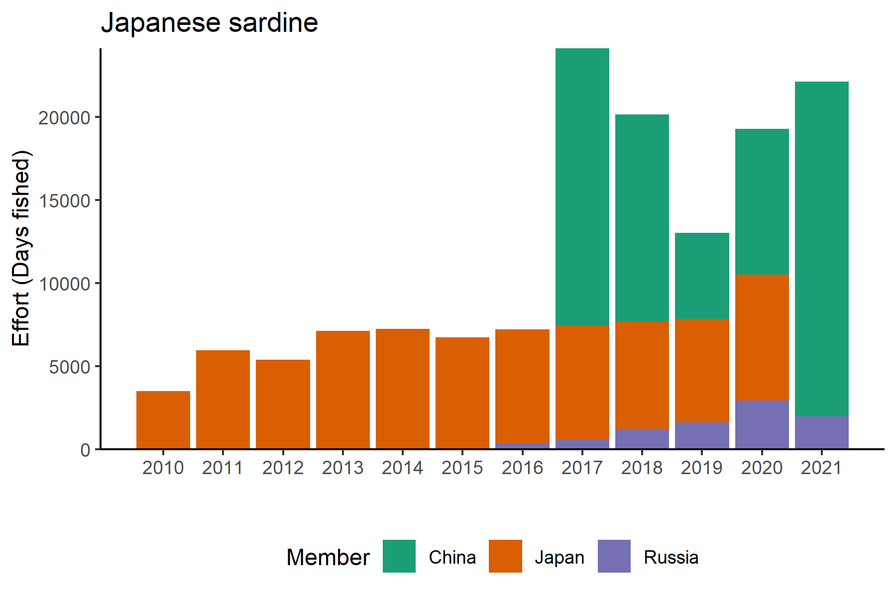

```{r setup, include=FALSE}
out_type <- knitr::opts_knit$get("rmarkdown.pandoc.to")
knitr::opts_chunk$set(warning = FALSE, mesNPAge = FALSE) 
options(tinytex.verbose = TRUE)

```

```{r, echo=FALSE}
out_type <- knitr::opts_knit$get("rmarkdown.pandoc.to")
```

```{r load package, include=FALSE}
library(rgdal)
library(rgeos)
library(sp)
library(ggplot2)
library(rfisheries)
library(tidyverse)
library(rnaturalearth)
library(sf)
library(readxl)
library(kableExtra)
library(GLDEX)
library(RColorBrewer)
library(flextable)
```


# Japanese sardine (*Sardinops melanostictus*)

**Common names:** 

拟沙丁鱼, Ni Sha Ding Yu (China)

マイワシ, Maiwashi (Japan)

정 어 리, Jeong-eoli (Korea)

Дальневосточная сардина (Russia)

```{r picture, fig.cap="Figure 1. Japanese Sardine (Sardinops melanostictus).", fig.align='center',echo=FALSE}



```

## Management

### Active NPFC Management Measures

The following NPFC conservation and management measure (CMM) pertains to this species: 

-   CMM 2021-11 For Japanese Sardine, Neon Flying Squid and Japanese Flying Squid

Available from https://www.npfc.int/active-conservation-and-management-measures

### Management Summary

The current management measure for Japanese Sardine does not specify catch or effort limits. The CMM states that Members and Cooperating non-Contracting Parties currently harvesting Japanese Sardine should refrain from expansion of the number of fishing vessels authorized to fish Japanese Sardine in the Convention Area. New harvest capacity should also be avoided until as stock assessment has been completed. 

A stock assessment for Japanese Sardine is conducted by Japan within their EEZ and used for management of the domestic fishery. 

```{r manaagment table,message=FALSE,warning=FALSE,results="hide", echo=FALSE}
tabledat<-data.frame("Convention or Management Principle"=c("Biological reference point(s)", "Stock status","Catch limit","Harvest control rule", "Other"), Status=c("Not accomplished","Unknown","Intermediate","Not accomplished","Intermediate"),"Comment or Consideration"=c("Not established","Status determination criteria not established","Recommended catch, effort limits","Not established","No expansion of fishing beyond established areas"))

```

```{r maketable,echo=FALSE}
flextable(tabledat)%>%set_header_labels(Convention.or.Management.Principle="Convention or Management Principle",Comment.or.Consideration="Comment or Consideration")%>%set_caption(caption='Management Summary')%>%theme_vanilla()%>%set_table_properties(width=.5,layout="autofit")%>%
  color(j=~Status,i=~Status=="Not accomplished",color="white")%>%bg(j=~Status,i=~Status=="Not accomplished",bg="red")%>%
  color(j=~Status,i=~Status=="Intermediate",color="white")%>%bg(j=~Status,i=~Status=="Intermediate",bg="orange")%>%
  color(j=~Status,i=~Status=="Unknown",color="white")%>%bg(j=~Status,i=~Status=="Unknown",bg="grey80")

```

## Assessment

There is currently no stock assessment for Japanese Sardine conducted by NPFC for the Convention Area. 

Japan conducts an assessment of the Japanese Sardine stock using VPA and a number of data sources described below [@Hiroshi2005StockAA].

## Data
### Surveys
Japan conducts three surveys that estimate recruitment for a number of pelagic species, including Japanese Sardine (Table 2). The surveys target pre-recruits and juveniles to determine an index of recruitment. Japan also conducts a monthly egg and larval survey that is used to estimate spawning stock biomass. Surveys are conducted in spring (1995-2020), summer (2001-2020) and fall (2005-2020) at 30-80 stations per year. The survey protocol can be found at [@Oozeki2007]. Russia has conducted a summertime acoustic-trawl survey since 2010 that examines mid-water and upper epipelagic species including Japanese Sardine. 

### Fishery

China, Japan and Russia catch Japanese sardine. China does not target the species, but it is captured as bycatch in other fisheries (e.g. chub mackerel). Catches are primarily by purse seine, with a smaller component of the catch taken by pelagic trawl. China’s catch of Japanese Sardine is taken exclusively from the Convention Area from April to December. China's existing catch records are from 2016 to 2020 and show increasing catches during that time period as the stock may have been increasing. The historical catches (prior to 2016) are unknown, thought to be low and likely need to be confirmed. 

Japan's fishery for Japanese Sardine occurs inside their EEZ and is mostly conducted by large purse seine vessels (>90% of the catch). Additional components of the fishery include set nets, dip nets and other gears. The fishery experienced very high catches in the 1980’s and early 1990’s, a decline to very low catches from 1995 to ~2010 and has been recovering since then. The fishery is conducted year round, but mainly during the summer season. 

The Russian fishery occurs inside their EEZ and is prosecuted primarily by pelagic trawling (>90% of the catch), with a smaller component of the catch coming from purse seines. The success of Russian fishery depends on the migration patterns and overall abundance of Japanese Sardine, as the sardine move into Russian waters when their abundance is high. For this reason, there was no catch from 1994-2011 when the stock abundance was low, but in recent years (since 2016) as the stock has recovered and water temperatures have been warm there have been increasing catches in Russia. The Russian fishery occurs primarily from June to November


```{r getcatchdata,message=FALSE,warning=FALSE,results="hide", echo=FALSE}
#FAO Data
#species = rfisheries::of_species_codes()
#species %>% 
#  filter(str_detect(scientific_name %>% tolower(), pattern = "sardinops"))

species.code<-c("JAP")

FAO_catch<-NULL
for(i in 1:length(species.code)){
temp1<-rfisheries::of_landings(species = species.code[i])
FAO_catch<-rbind(FAO_catch,temp1)}
FAO_catch<-data.frame(Year=FAO_catch$year,Catch=FAO_catch$catch,Member="FAO - historical")

#NPFC DATA
download.file("https://www.npfc.int/system/files/2021-04/NPFC-2021-AR-Annual%20Summary%20Footprint%20-%20Japanese%20Sardine.xlsx", destfile="JS_catch.xlsx",mode="wb", quiet = FALSE)

NPFC_catch<-data.frame(read_xlsx("JS_catch.xlsx",sheet="Catch",skip=5))
NPFC_catch<-data.frame(Year=as.numeric(NPFC_catch[,1]),China=as.numeric(NPFC_catch[,2]),Japan=as.numeric(NPFC_catch[,5]),Russia=as.numeric(NPFC_catch[,8]))

NPFC_catch<-data.frame(pivot_longer(NPFC_catch,China:Russia,names_to="Member",values_to="Catch"))
minyear<-min(NPFC_catch$Year,na.rm=TRUE)
FAO_catch<-subset(FAO_catch,FAO_catch<minyear)
catch<-rbind(FAO_catch,NPFC_catch)
catch$Member<-factor(catch$Member,levels=c("FAO - historical","China","Japan","Russia"))

p1<-ggplot(catch)+geom_bar(aes(x=Year,y=Catch/1000,fill=Member),stat="identity",position="stack")+
  ggtitle("Japanese sardine")+ylab("Catch (*1,000 metric tons)")+xlab("") + scale_x_continuous(breaks = seq(min(catch$Year,na.rm=TRUE),max(catch$Year,na.rm=TRUE),10))+
  scale_y_continuous(expand=c(0,0))+scale_fill_brewer(palette="Set1")+
       theme_bw() +
     theme(axis.line = element_line(colour = "black"),
           panel.grid.major = element_blank(),
           panel.grid.minor = element_blank(),
           panel.border = element_blank(),
           panel.background = element_blank(),
           legend.position=c(.8,.65))

png("Figures/Figure3.png",width=6, height=4,units="in",res=300)
p1
dev.off()
```

```{r picture2, fig.cap="Historical catch of Japanese Sardine.", echo=FALSE}



```

Other NPFC Members (Canada, Korea, Chinese Taipei, USA and Vanuatu) do not target Japanese Sardine. Chinese Taipei has some historical records of Japanese Sardine bycatch in the Pacific Saury fishery (~100 mt) and Korea has a small amount of historical bycatch data from the bottom trawl fishery. Vanuatu, USA adn Canada have no record of Japanese Sardine catches.

Fishery catch data is available for Members from the NPFC website (https://www.npfc.int/system/files/2021-04/NPFC-2021-AR-Annual%20Summary%20Footprint%20-%20Japanese%20Sardine.xlsx) since 2001. Prior years fishery catch data was downloaded from FAO data collections at https://www.npfc.int/system/files/2021-04/NPFC-2021-AR-Annual%20Summary%20Footprint%20-%20Japanese%20Sardine.xlsx using rfisheries package [@Karthik2013]. 


```{r effort data,message=FALSE,warning=FALSE,results="hide", echo=FALSE}
NPFC_effort<-data.frame(read_xlsx("JS_catch.xlsx",sheet="Effort",skip=19,col_types='numeric'))
NPFC_effort[is.na(NPFC_effort)]<-0
NPFC_effort<-data.frame(Year=as.numeric(NPFC_effort[,1]),China=as.numeric(NPFC_effort[,2])+as.numeric(NPFC_effort[,3]),
                       Japan=as.numeric(NPFC_effort[,5])+as.numeric(NPFC_effort[,4]),Russia=as.numeric(NPFC_effort[,6])+
                      as.numeric(NPFC_effort[,7])+as.numeric(NPFC_effort[,8])+as.numeric(NPFC_effort[,9])+as.numeric(NPFC_effort[,10]))
NPFC_effort<-pivot_longer(NPFC_effort,China:Russia,names_to="Member",values_to="Effort")

p1<-ggplot(NPFC_effort)+geom_bar(aes(x=Year,y=Effort,fill=Member),stat="identity",position="stack")+
  ggtitle("Japanese sardine")+ylab("Effort (Days fished)")+xlab("") + scale_x_continuous(breaks = seq(2010,max(NPFC_effort$Year),1))+
  scale_y_continuous(expand=c(0,0))+scale_fill_brewer(palette="Dark2")+
       theme_bw() +
     theme(axis.line = element_line(colour = "black"),
           panel.grid.major = element_blank(),
           panel.grid.minor = element_blank(),
           panel.border = element_blank(),
           panel.background = element_blank(),
           legend.position="bottom")

png("Figures/Figure4.png",width=6, height=4,units="in",res=300)
p1
dev.off()


```


```{r picture1, fig.cap="Historical fishing effort for Japanese Sardine.", echo=FALSE}



```


### Biological collections

China collected biological data from fishery catches of Japanese Sardine in 2020. These collections included length data as well as maturity and age structures.

Russia collects length and weight data, age structures (scales) and maturity data from both commercial catches and surveys. 

Japan also collects length, weight, maturity and age data from the survey and fishery to support their stock assessment.


```{r data table,message=FALSE,warning=FALSE,results="hide", echo=FALSE}
tabledat<-read.csv("js_datatable.csv",header=TRUE)
```

```{r makedatatable,echo=FALSE}

flextable(tabledat)%>%set_caption(caption = 'Data availability from Members regarding Japanese Sardine')%>%theme_vanilla()%>%set_table_properties(width=.75,layout="autofit")
    
```
## Special Comments

None

## Biological Information

### Distribution
Japanese sardine (*Sardinops melanostichtus*; Figure 1) are a pelagic species that occurs in large migratory schools in the coastal waters of China, Chinese Taipei, Japan, Korea and Russia (Figure 4, [@Kaschner2019]). They generally migrate from the south to the north during summer, returning to inshore areas in the south to spawn in the winter. Japanese sardine feed mainly on zooplankton and phytoplankton. 

### Life history
Japanese sardine are short-lived and fast growing, maturing early at 2-years old. Their maximum length is ~24 cm and their maximum reported age is 25 years [@Whitehead1985]. Their growth rates and spawning patterns are highly influenced by the environment [@Niino2021]

Taxonomically, the Japanese sardine are closely related to other species around the globe including Sardinops from southern Africa, Australia, South America and California. 

```{r MapTheDistribution,message=FALSE,warning=FALSE,results="hide", echo=FALSE}
#IMPORT DISTRIBUTION POINTS (THESE ARE A PLACEHOLDER FROM AQUAMAPS)
dist_points<-read.csv("1622759758.csv",skip=7,header=TRUE)
data1<-data.frame(Lon=dist_points$Center.Long,Lat=dist_points$Center.Lat)

#IMPORT THE BASEMAP AND TRANSFORM TO A NICER PROJECTION FOR THE NORTH PACIFIC
bg = ne_countries(scale = "medium",  returnclass = "sf")
bg1<-st_transform(bg,3832)

#TRANSFORM THE POINTS TO THE SAME PROJECTION AND ADD THEM TO THE DATA SET
data2<-project(cbind(data1$Lon,data1$Lat),"+proj=merc +lon_0=150 +k=1 +x_0=0 +y_0=0 +datum=WGS84 +units=m +no_defs")
data1$LonP<-data2[,1]
data1$LatP<-data2[,2]
data1<-subset(data1,data1$Lon>0)

#MAKE A SET OF BOUNDARIES TO USE AS THE PLOTTING RANGE (LIMITS ON LONGITUDE AND LATITUDE)
data3<-data.frame(cbind(c(130,235),c(62,10)))
data3<-proj4::project(data3,"+proj=merc +lon_0=150 +k=1 +x_0=0 +y_0=0 +datum=WGS84 +units=m +no_defs")

#PLOT THE ENTIRE SET WITH THE MAP AS THE BACKGROUND
p<-ggplot()+
  #basemap
  geom_sf(data = bg1)+
  coord_sf(xlim = range(data3$x, na.rm = TRUE), 
           ylim = range(data3$y, na.rm = TRUE), 
           expand = TRUE)+
  
  # add points
  geom_point(data = data1, 
             aes(x=LonP,y=LatP),
             alpha = 0.7, shape=20, col="red",size = 3)+
  
  # formatting
  theme_dark()+xlab("Longitude")+ylab("Latitude")+
  scale_x_continuous(breaks = seq(130,240,10)) +
  theme(panel.grid = element_blank())
png("Figures/Figure2.png",height=4,width=6,unit="in",res=300)
print(p)
dev.off()
```

```{r picture4, fig.cap="Map of distribution of Sardine species in the North Pacific.", echo=FALSE}


```

## Literature cited

