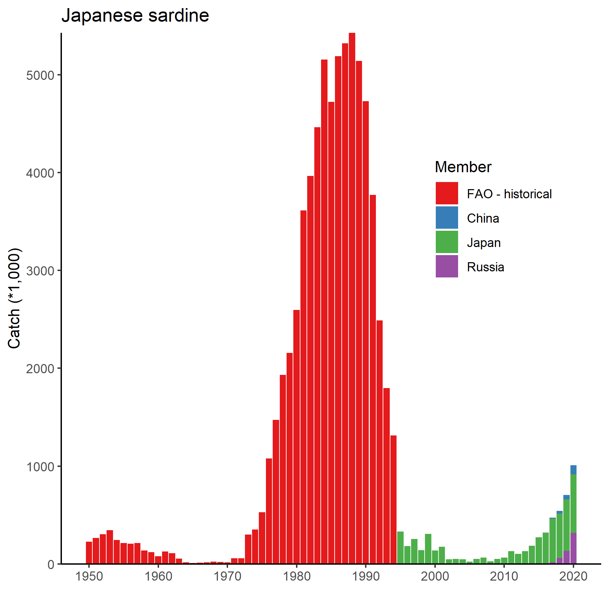
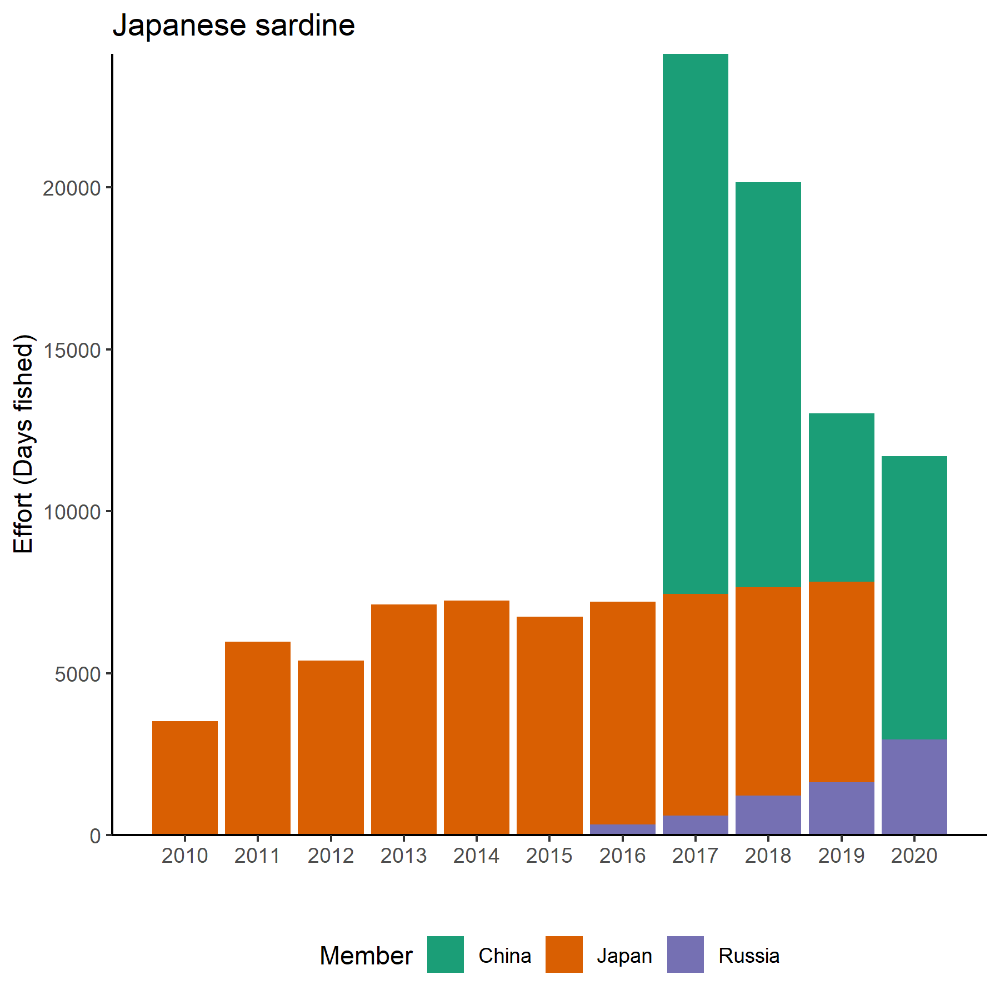
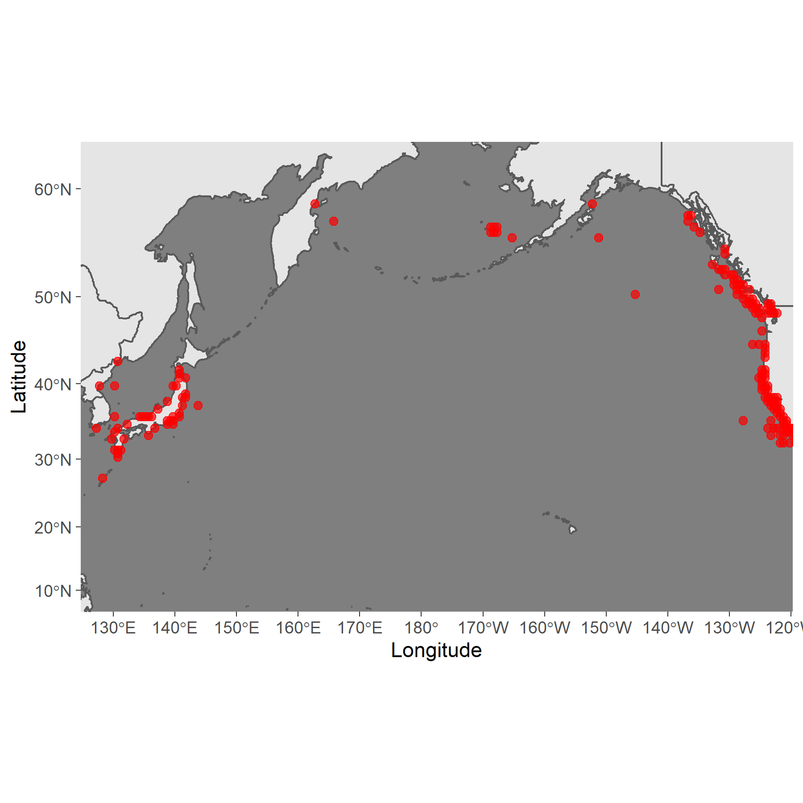

```{r setup, include=FALSE}
library(rgdal)
library(rgeos)
library(sp)
library(ggplot2)
library(rfisheries)
library(tidyverse)
library(rnaturalearth)
library(sf)
library(readxl)
library(kableExtra)

```
# Japanese sardine (*Sardinops melanostictus*)

**Common names:** (Chinese); Japanese Sardine; (Japanese); (Korean); (Russian) - Need names in each language

**Other common names**

```{r picture, fig.cap="Placeholder picture of Pacific Sardine.", echo=FALSE}

knitr::include_graphics("Figures/pacific_sardine.jpg")

```
## Management

### Active NPFC Management Measures

The following NPFC conservation and mangement measure (CMM) pertains to this species: 

CMM 2021-11 For Japanese Sarding, Neon Flying Squid and Japanese Flying Squid


### Management Summary

The current management measure for Japanese Sardine does not specify catch or effort limits. The CMM states that Members and Cooperating non-Contracting Parties currently harvesting Japanese Sardine should refrain from expansion of the number of fishing vessels authorized to fish Japanese Sardine in the Convention Area. New harvest capacity should also be avoided until as stock assessment has been completed. 

Stock assessments for Japanese Sardine are conducted by Japan for their National Waters and management is based off of these assessments. 

```{r manaagment table,message=FALSE,warning=FALSE,results="hide", echo=FALSE}
tabledat<-data.frame("Convention or Management Principle"=c("Biological reference point(s)", "Stock status","Catch limit","Harvest control rule", "Other"), Status=c(1,0,2,1,2),"Comment or Consideration"=c("Not established","Status determination criteria not established","Recommended catch, effort limits","Not established","No expansion of fishing beyond established areas"))

hcolor<-c("gray","red","yellow","green")
```

```{r maketable,echo=FALSE}
tabledat%>%kbl(col.names=c("Convention or Management Principle","Status","Comment or Consideration"))%>%kable_classic_2(full_width=F)%>%
    column_spec(2, color = hcolor[tabledat$Status+1],
              background = hcolor[tabledat$Status+1])%>%
  footnote("\\\\textcolor{green}{OK}, \\\\textcolor{yellow}{Intermediate}, \\\\textcolor{red}{Not accomplished}, \\\\textcolor{gray}{Unknown}", title_format="bold",escape = F)
    
    
```

## Stock Assessment

No stock assessment has been conducted by NPFC for the convention area.  Japan has conducted a stock assessment in their national waters [@Hiroshi2005StockAA].

## Data
### Survey
Japan conducts three surveys that estimate recruitment for a number of pelagic species, including Japanese Sardine (Table 2). Surveys are conducted in spring (1995-2020), summer (2001-2020) and fall (2005-2020) at 30-80 stations per year. The survey protocol can be found at [website?]. Russia has conducted a summertime acoustic-trawl survey since 2010 that examines mid-water and upper epi-pelagic species including Japanese Sardine. 

### Fishery

THe fishery for Japanese Sardine is conducted mainly with purse seines and set nets in Japanese domestic waters. The Russian fishery uses purse seines and pelagic trawls. [insert other relevant characteristics]

Fishery catch data is available for Members from the NPFC website (https://www.npfc.int/system/files/2021-04/NPFC-2021-AR-Annual%20Summary%20Footprint%20-%20Japanese%20Sardine.xlsx) since 2001. Previous fishery catch data was downloaded from FAO data collections at https://www.npfc.int/system/files/2021-04/NPFC-2021-AR-Annual%20Summary%20Footprint%20-%20Japanese%20Sardine.xlsx using rfisheries package. 

```{r getcatchdata,message=FALSE,warning=FALSE,results="hide", echo=FALSE}
#FAO Data
#species = rfisheries::of_species_codes()
#species %>% 
#  filter(str_detect(scientific_name %>% tolower(), pattern = "sardinops"))

species.code<-c("JAP")

FAO_catch<-NULL
for(i in 1:length(species.code)){
temp1<-rfisheries::of_landings(species = species.code[i])
FAO_catch<-rbind(FAO_catch,temp1)}
FAO_catch<-data.frame(Year=FAO_catch$year,Catch=FAO_catch$catch,Member="FAO - historical")

#NPFC DATA
download.file("https://www.npfc.int/system/files/2021-04/NPFC-2021-AR-Annual%20Summary%20Footprint%20-%20Japanese%20Sardine.xlsx", destfile="JS_catch.xlsx",mode="wb", quiet = FALSE)

NPFC_catch<-data.frame(read_xlsx("JS_catch.xlsx",sheet="Catch",skip=5))
NPFC_catch<-data.frame(Year=as.numeric(NPFC_catch[,1]),China=as.numeric(NPFC_catch[,2]),Japan=as.numeric(NPFC_catch[,5]),Russia=as.numeric(NPFC_catch[,8]))

NPFC_catch<-data.frame(pivot_longer(NPFC_catch,China:Russia,names_to="Member",values_to="Catch"))
minyear<-min(NPFC_catch$Year,na.rm=TRUE)
FAO_catch<-subset(FAO_catch,FAO_catch<minyear)
catch<-rbind(FAO_catch,NPFC_catch)
catch$Member<-factor(catch$Member,levels=c("FAO - historical","China","Japan","Russia"))

p1<-ggplot(catch)+geom_bar(aes(x=Year,y=Catch/1000,fill=Member),stat="identity",position="stack")+
  ggtitle("Japanese sardine")+ylab("Catch (*1,000)")+xlab("") + scale_x_continuous(breaks = seq(min(catch$Year,na.rm=TRUE),max(catch$Year,na.rm=TRUE),10))+
  scale_y_continuous(expand=c(0,0))+scale_fill_brewer(palette="Set1")+
       theme_bw() +
     theme(axis.line = element_line(colour = "black"),
           panel.grid.major = element_blank(),
           panel.grid.minor = element_blank(),
           panel.border = element_blank(),
           panel.background = element_blank(),
           legend.position=c(.8,.65))

png("Figures/Figure3.png",width=6, height=4,units="in",res=300)
p1
dev.off()
```

```{r picture2, fig.cap="Historical catch of Japanese Sardine.", echo=FALSE}



```

[insert text here]

```{r effort data,message=FALSE,warning=FALSE,results="hide", echo=FALSE}
NPFC_effort<-data.frame(read_xlsx("JS_catch.xlsx",sheet="Effort",skip=19,col_types='numeric'))
NPFC_effort[is.na(NPFC_effort)]<-0
NPFC_effort<-data.frame(Year=as.numeric(NPFC_effort[,1]),China=as.numeric(NPFC_effort[,2])+as.numeric(NPFC_effort[,3]),
                       Japan=as.numeric(NPFC_effort[,5])+as.numeric(NPFC_effort[,4]),Russia=as.numeric(NPFC_effort[,6])+
                      as.numeric(NPFC_effort[,7])+as.numeric(NPFC_effort[,8])+as.numeric(NPFC_effort[,9])+as.numeric(NPFC_effort[,10]))
NPFC_effort<-pivot_longer(NPFC_effort,China:Russia,names_to="Member",values_to="Effort")

p1<-ggplot(NPFC_effort)+geom_bar(aes(x=Year,y=Effort,fill=Member),stat="identity",position="stack")+
  ggtitle("Japanese sardine")+ylab("Effort (Days fished)")+xlab("") + scale_x_continuous(breaks = seq(2010,max(NPFC_effort$Year),1))+
  scale_y_continuous(expand=c(0,0))+scale_fill_brewer(palette="Dark2")+
       theme_bw() +
     theme(axis.line = element_line(colour = "black"),
           panel.grid.major = element_blank(),
           panel.grid.minor = element_blank(),
           panel.border = element_blank(),
           panel.background = element_blank(),
           legend.position="bottom")

png("Figures/Figure4.png",width=6, height=4,units="in",res=300)
p1
dev.off()


```


```{r picture1, fig.cap="Historical fishing effort for Japanese Sardine.", echo=FALSE}



```


Table 1. Data availability from Members regarding Japanese Sardine

```{r data table,message=FALSE,warning=FALSE,results="hide", echo=FALSE}
tabledat<-read.csv("js_datatable.csv",header=TRUE)
```

```{r makedatatable,echo=FALSE}
kable(tabledat)
    
```
## Special Comments

[insert text here]


## Biological Information

### Distribution
Japanese sardine (*Sardinops melanostichtus*; Figure 1) are a pelagic species that occurs in large migratory schools in the coastal waters of  China, Chinese Taipei, Japan, Korea and Russia (Figure 2). They generally migrate from the south to the north during summer, returning to inshore areas in the south to spawn in the winter. Japanese sardine feed mainly on zooplankton and phytoplankton. 

### Life history
Japanese sardine are short-lived and fast growing, maturing early at 2-years old. Their maximum length is ~24 cm and their maximum reported age is 25 years [@Whitehead1985]. Their growth rates and spawning patterns are highly influenced by the environment [@Niino2021]

Taxonomically, the Japanese sardine are closely related to other species around the globe inlcuding Sardinops from southern Africa, Australia, South America and California. 

[Insert additional text here]

```{r MapTheDistribution,message=FALSE,warning=FALSE,results="hide", echo=FALSE}
#IMPORT DISTRIBUTION POINTS (THESE ARE A PLACEHOLDER FROM AQUAMAPS)
dist_points<-read.csv("1622759758.csv",skip=7,header=TRUE)
data1<-data.frame(Lon=dist_points$Center.Long,Lat=dist_points$Center.Lat)

#IMPORT THE BASEMAP AND TRANSFORM TO A NICER PROJECTION FOR THE NORTH PACIFIC
bg = ne_countries(scale = "medium",  returnclass = "sf")
bg1<-st_transform(bg,3832)

#TRANSFORM THE POINTS TO THE SAME PROJECTION AND ADD THEM TO THE DATA SET
data2<-project(cbind(data1$Lon,data1$Lat),"+proj=merc +lon_0=150 +k=1 +x_0=0 +y_0=0 +datum=WGS84 +units=m +no_defs")
data1$LonP<-data2[,1]
data1$LatP<-data2[,2]

#MAKE A SET OF BOUNDARIES TO USE AS THE PLOTTING RANGE (LIMITS ON LONGITUDE AND LATITUDE)
data3<-data.frame(cbind(c(130,235),c(62,10)))
data3<-proj4::project(data3,"+proj=merc +lon_0=150 +k=1 +x_0=0 +y_0=0 +datum=WGS84 +units=m +no_defs")

#PLOT THE ENTIRE SET WITH THE MAP AS THE BACKGROUND
p<-ggplot()+
  #basemap
  geom_sf(data = bg1)+
  coord_sf(xlim = range(data3$x, na.rm = TRUE), 
           ylim = range(data3$y, na.rm = TRUE), 
           expand = TRUE)+
  
  # add points
  geom_point(data = data1, 
             aes(x=LonP,y=LatP),
             alpha = 0.7, shape=20, col="red",size = 3)+
  
  # formatting
  theme_dark()+xlab("Longitude")+ylab("Latitude")+
  scale_x_continuous(breaks = seq(130,240,10)) +
  theme(panel.grid = element_blank())
png("Figures/Figure2.png",height=4,width=6,unit="in",res=300)
print(p)
dev.off()
```

```{r picture4, fig.cap="Map of distribution of Sardine species in the North Pacific.", echo=FALSE}



```

## Literature cited

Kaschner, K., Kesner-Reyes, K., Garilao, C., Segschneider, J., Rius-Barile, J. Rees, T., & Froese, R. 2019. AquaMaps: Predicted range maps for aquatic species. Data retrieved from https://www.aquamaps.org.

Karthik Ram, Carl Boettiger and Andrew Dyck (2013). rfisheries: R   interface for fisheries data. R package version 0.1.
  http://CRAN.R-project.org/package=rfisheries
