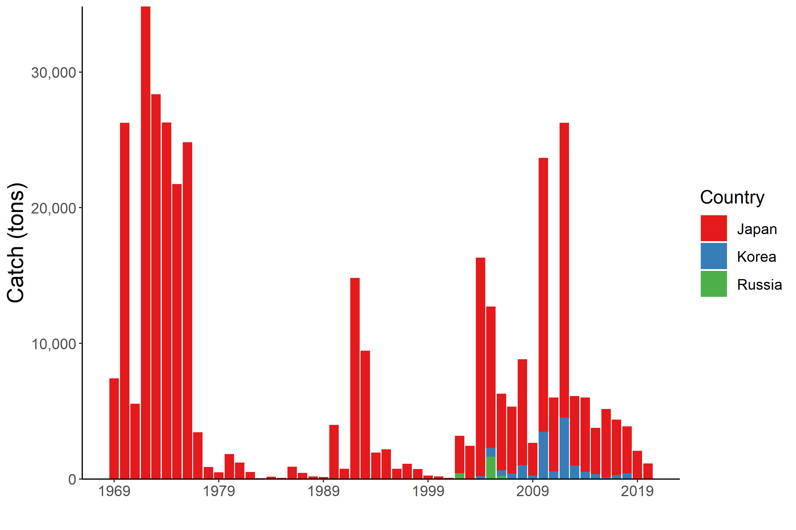
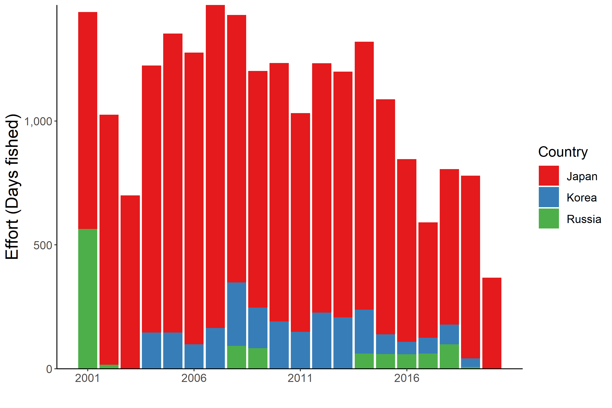

```{r setup, echo=FALSE}
out_type <- knitr::opts_knit$get("rmarkdown.pandoc.to")
knitr::opts_chunk$set(warning = FALSE, mesNPAge = FALSE) 
options(tinytex.verbose = TRUE)
```

```{r, echo=FALSE}
out_type <- knitr::opts_knit$get("rmarkdown.pandoc.to")
```

```{r load package, include=FALSE}
library(rgdal)
library(rgeos)
library(sp)
library(ggplot2)
library(rfisheries)
library(tidyverse)
library(rnaturalearth)
library(sf)
library(readxl)
library(kableExtra)
library(GLDEX)
library(RColorBrewer)
```

# North Pacific Armorhead (*Pentaceros wheeleri*)

**Common names:** Pelagic armorhead, Slender armorhead (English): , 胸五棘鯛 (Chinese); クサカリツボダイ (Japanese); Minsajagu (Korean); Рыба-кабан (Russian)

## Biological Information

Distribution includes North Pacific -- Gulf of Alaska to North Pacific Ocean off central California and south of Japan, with center of abundance at the seamounts of the southern Emperor-northern Hawaiian Ridge within the Convention area. North Pacific Armorhead (NPA) have a unique life history with extended pelagic phase (2+ years), followed by morphometric changes concurrent with recruitment to a demersal stage on seamounts.

```{r picture, fig.cap="**Figure 1: Photographs of Pentaceros wheeleri. A) Pelagic juvenile, B) pelagic subadult, C) demersal adult (fat type), D) demersal adult (lean type) (from Kiyota et al. 2016)</br>", out.width="70%", out.height="70%", fig.align='center', echo=FALSE}


```

```{r picture2, fig.cap="**Figure 2: Known demersal habitats and hypothesized pelagic migration routes of Pentaceros wheeleri (Kiyota et al. 2016 Figure 4, modified from Boehlert and Sasaki 1988).</br>", out.width="80%", out.height="80%", fig.align='center', echo=FALSE}

knitr::include_graphics("Figures/NPA_DistributionMap.jpg")
```

## Fishery

Historical catches (Russia and Japan) from the combined Emperor Seamounts were high and reached 1 million mt in 1975, followed by a crash (Kiyota et al. 2016). Currently NPA is caught by Japan and Korea on the Emperor Seamounts using bottom trawls and gillnets. This fishery is a potential source of SAI for vulnerable marine ecosystems due to bottom contact gear. Observers are required for NPFC bottomfishing (per CMM 2019-05).

Fishing typically begins in January and extends until [need date].

```{r getcatchdata,message=FALSE,warning=FALSE,results="hide", echo=FALSE}
#FAO Data
#species = rfisheries::of_species_codes()
#species %>% 
#  filter(str_detect(scientific_name %>% tolower(), pattern = "sardinops"))

#NPFC DATA
download.file("https://www.npfc.int/system/files/2021-04/NPFC-2021-AR-Annual%20Summary%20Footprint%20-%20Bottom%20Fisheries.xlsx", destfile="NPA_catch.xlsx",mode="wb", quiet = FALSE)

catch<-data.frame(read_xlsx("NPA_catch.xlsx",sheet="Catch Summary",col_types = "numeric", skip=111)) %>% 
  rename(Year=1,Japan_Trawl=2,Japan_Gillnet=3,Korea_Trawl=4,Korea_Longline=5,Russia_Trawl=6,Russia_Longline=7,Total=8) %>% 
  mutate(Japan=Japan_Trawl+Japan_Gillnet,Korea=Korea_Trawl+Korea_Longline,Russia=Russia_Trawl+Russia_Longline) %>% 
  select(Year,Japan:Russia) %>% 
  filter(Year>0)

catch<-data.frame(pivot_longer(catch,Japan:Russia,names_to="Member",values_to="Catch"))
minyear<-min(catch$Year,na.rm=TRUE)
catch$Member<-factor(catch$Member,levels=c("Japan", "Korea", "Russia"))

p1<-ggplot(catch)+geom_bar(aes(x=Year,y=Catch,fill=Member),stat="identity",position="stack")+
  ylab("Catch (tons)")+xlab("") + scale_x_continuous(breaks = seq(min(catch$Year,na.rm=TRUE),max(catch$Year,na.rm=TRUE),10))+
  scale_y_continuous(expand=c(0,0))+scale_fill_brewer(palette="Set1")+
  theme_bw() +
  theme(axis.title = element_text(size = 18),
        axis.text.x = element_text(size = 12),
        axis.text.y = element_text(size = 12),
        axis.line = element_line(colour = "black"),
        panel.grid.major = element_blank(),
        panel.grid.minor = element_blank(),
        panel.border = element_blank(),
        panel.background = element_blank(),
        legend.justification="center",
        legend.key.size = unit(0.8, "cm"),
        legend.title = element_text(size = 15),
        legend.text = element_text(size = 12))

png("Figures/NPA_Catch.png",width=9, height=6,units="in",res=300)
print(p1)
dev.off()
```

```{r picture3, fig.cap="**Figure 3: Catch trends of North Pacific Armorhead over the past two decades.** The annual amounts of catch for alfonsino by each Member are shown by the bar plot.", out.width="80%", out.height="80%", fig.align='center', echo=FALSE}



```

```{r effort data,message=FALSE,warning=FALSE,results="hide", echo=FALSE}
NPFC_effort<-data.frame(read_xlsx("NPA_catch.xlsx",sheet="Vessel Summary",skip=28,col_types='numeric')) %>% 
  mutate_all(funs(ifelse(is.na(.),0,.))) %>% 
  mutate(Japan=Japan...2+Japan...9, Korea=Korea...3+Korea...6, Russia=Russia...4+Russia...7+Russia...10)

NPFC_effort<-data.frame(pivot_longer(NPFC_effort,Japan:Russia,names_to="Member",values_to="Effort")) %>% 
  select(-(Japan...2:Russia...10))

p1<-ggplot(NPFC_effort)+geom_bar(aes(x=Year,y=Effort,fill=Member),stat="identity",position="stack")+
  ylab("Effort (Days fished)")+xlab("") + scale_x_continuous(breaks = seq(2001,max(NPFC_effort$Year),5))+
  scale_y_continuous(expand=c(0,0))+scale_fill_brewer(palette="Set1")+
  theme_bw() +
  theme(axis.title = element_text(size = 18),
        axis.text.x = element_text(size = 12),
        axis.text.y = element_text(size = 12),
        axis.line = element_line(colour = "black"),
        panel.grid.major = element_blank(),
        panel.grid.minor = element_blank(),
        panel.border = element_blank(),
        panel.background = element_blank(),
        legend.justification="center",
        legend.key.size = unit(0.8, "cm"),
        legend.title = element_text(size = 15),
        legend.text = element_text(size = 12))

png("Figures/NPA_Effort.png",width=9, height=6,units="in",res=300)
p1
dev.off()
```

```{r picture1, fig.cap="**Figure 4. Historical fishing effort for North Pacific Armorhead.**", out.width="70%", out.height="70%", fig.align='center', echo=FALSE}



```

## Assessment

There is no current or accepted assessment for this species.

There are no biomass estimates available for NPA in NPFC waters. An age- or length-structured stock assessment is unlikely to be feasible given the life history of NPA (citation for more information). Data limited approaches may be examined in the future.

## Management

**Active Management Measures**

The following NPFMC conservation and management measures pertain to this species:

-   CMM 2019-05 For Bottom Fisheries and Protection of VMEs in the NW Pacific Ocean

-   CMM 2019-06 For Bottom Fisheries and Protection of VMEs in the NE Pacific Ocean

Available from <https://www.npfc.int/active-conservation-and-management-measures>

```{r manaagment table,message=FALSE,warning=FALSE, results='asis', echo=FALSE}
MngmtTable<-data.frame(
row.names = c("Biological reference points", "Stock status","Catch limit","Harvest control rule", "Other"), 
Status = c("Not accomplished", "Unknown", "Intermediate", "Not accomplished", "Intermediate"),
Comment = c("Not established","Status determination criteria not established","Recommended catch, effort limits","Not established","No expansion of fishing beyond established areas"))

cols <- brewer.pal(9, "Set1")

switch (out_type,
      html = MngmtTable %>% 
        kable(caption = '<font size= "5">Management Summary</font>')%>% 
        kable_paper(full_width=F)%>%
        row_spec(0, bold = T, color = "white")%>% 
        column_spec(1, bold = T) %>% 
        column_spec(2, background = c(cols[1], cols[9], cols[5], cols[1], cols[5]), color = "white") %>% 
        kable_styling(font_size = 18, bootstrap_options = c("basic", "striped")
        ))

```

In 2019 an adaptive management plan was implemented for NPA (NPFC-2019-SSC BF02-WP05, CMM 2019-05). This plan specifies data collection via an annual monitoring survey to be conducted in March-June each year on Koko and Kammu Seamounts. If the survey finds evidence of strong recruitment (see CMM 2019-05 and NPFC-2019-SSC BF02-IP01 for details) some area in the Emperor Seamounts are closed and a 12,000 ton catch limit is encouraged. In low recruitment years, a 700 ton catch limit is encouraged.

## Data Summary

```{r data table, echo=FALSE}
options(knitr.kable.NA = '')

DataTable <-data.frame(read_xlsx("NPA_Species_Summary_Data.xlsx"))

switch (out_type,
  html = DataTable %>% 
    kbl(col.names = c("Data type", "Source", "Years available", "Comment"))%>% 
  kable_paper(full_width=F) %>% 
    row_spec(0, bold = T, color = "white") %>% 
    column_spec(3, width = "15em") %>% 
    kable_styling(font_size = 15, bootstrap_options = c("basic", "striped"))
)
```

## References

Boehlert, G. W., and T. Sasaki. 1988. Pelagic biogeography of the armorhead, Pseudopentaceros wheeleri, and recruitment to isolated seamounts in the North Pacific Ocean. Fish. Bull. 86:453--465.

Kiyota M., Nishida K., Murakami C. and Yonezaki S. 2016. History, biology, and conservation of Pacific endemics 2. The North Pacific armorhead, Pentaceros wheeleri (Hardy, 1983) (Perciformes, Pentacerotidae). Pacific Science 70(1): 1-20.
