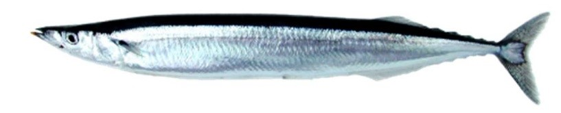
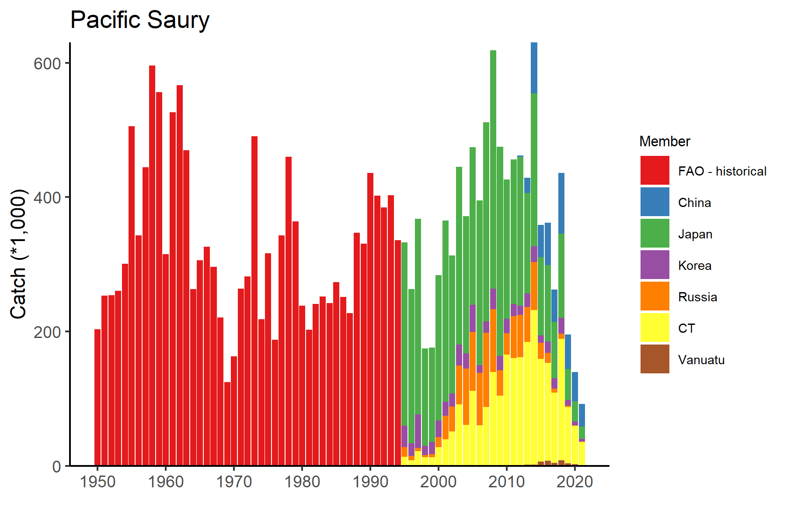
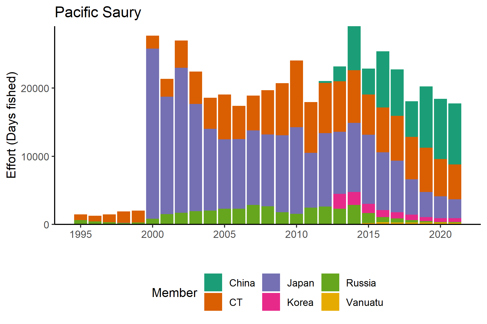
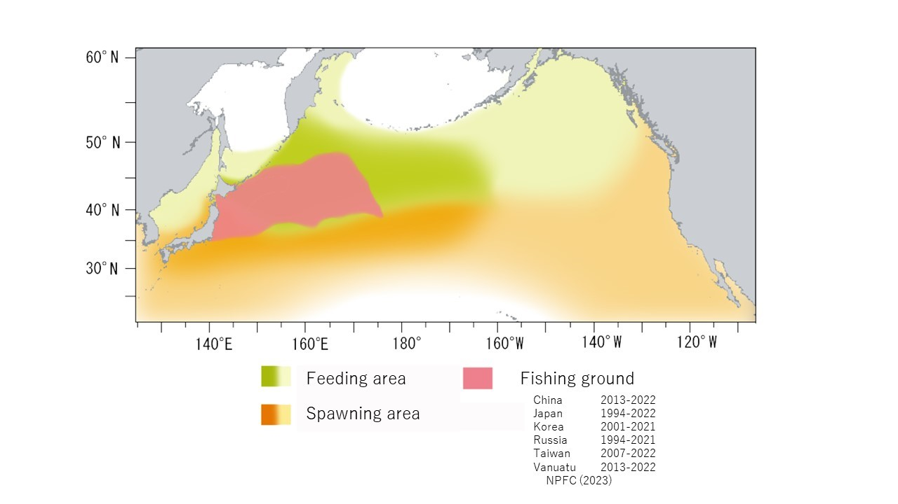

```{r setup, include=FALSE}
out_type <- knitr::opts_knit$get("rmarkdown.pandoc.to")
knitr::opts_chunk$set(warning = FALSE, mesNPAge = FALSE) 
options(tinytex.verbose = TRUE)

```

```{r, echo=FALSE}
out_type <- knitr::opts_knit$get("rmarkdown.pandoc.to")
```

```{r load package, include=FALSE}
library(rgdal)
library(rgeos)
library(sp)
library(ggplot2)
library(rfisheries)
library(tidyverse)
library(rnaturalearth)
library(sf)
library(readxl)
library(kableExtra)
library(GLDEX)
library(RColorBrewer)
library(flextable)
```


# Japanese sardine (*Cololabis saira*)

**Common names:** 

秋刀鱼, Qiū dāoyú (China)

サンマ, 秋刀魚, Sanma (Japan) 

꽁치, kkongchi (Korea)

сайра, Saira (Russia)

秋刀魚, Chiu-dao-yu or 山瑪魚, San-ma-hi (Chinese Taipei)

Pacific saury, balaou du Pacifique (Vanuatu)


```{r picture, fig.cap="Figure 1. Pacific Saury Sardine (*Cololabis saira*).", echo=FALSE}



```

## Management

### Active NPFC Management Measures

The following NPFC conservation and management measure (CMM) pertains to this species: 

-   CMM 2023-08 For Pacific Saury

Available from https://www.npfc.int/active-conservation-and-management-measures

### Management Summary

The current management measure for Pacific Saury specifies both catch and effort limits guided by science advice provided in the form of a stock assessment conducted by the Small Scientific Committee on Pacific Saury. For 2023 and 2024 Members of the Commission agree that the annual catches of Pacific saury in the Convention Area and the areas under their jurisdiction adjacent to the Convention Area should not exceed 250,000 metric tons. In these years, the annual total allowable catch (TAC) of Pacific saury in the Convention Area shall be limited to 150,000 metric tons. Each Member of the Commission shall reduce the annual total catch of Pacific saury by the fishing vessels entitled to fly its flag in 2023 and 2024 by 55% from its reported catch in 2018. 

The current management measure also states that each Member of the Commission participating in Pacific saury fisheries shall implement either of the following measures;

(a) to reduce the number of fishing vessels flying its flag and fishing for Pacific saury in the
Convention Area by 10% from the number of its fishing vessels that fished for Pacific saury
in the Convention Area in 2018; or

(b) to prohibit fishing vessels flying its flag from engaging in fishing for Pacific saury in the
Convention Area outside its designated fishing period of no longer than 180 consecutive
days each year.

In order to protect juvenile fish, Members of the Commission shall take measures for fishing vessels flying their flags to refrain from fishing for Pacific saury in the areas east of 170°E from June to July.


```{r managementtable,echo=FALSE,eval=TRUE}

mngmt_table <- data.frame("Convention or Management Principle"=c("Biological reference point(s)", "Stock status","Catch limit","Harvest control rule", "Other"), Status=c("Established","Established","Established","Intermediate","Not accomplished"),"Comment or Consideration"=c("Updated annually in stock assessment","Updated annually in stock assessment","Recommended catch limits updated routinely by Commission","In progress by SWG MSE PS","Management strategy evaluation in progress, Age structured model development in progress"))

cols <- brewer.pal(9, "Set1")
switch_status_bg <- function(x){
  switch(x,
         "Not accomplished" = cols[1],
         "Intermediate" = cols[5],
         "Established" = cols[3], 
         "Unknown" = cols[9]
  )
}
bg_cols <- c()
for (i in mngmt_table$Status){
  bg_cols <- append(bg_cols, switch_status_bg(i))
}

mngmt_table %>%
  flextable() %>%
  #align(part = "all") %>% # left align
  set_caption(caption = "Table 1. Current status of NPFC management measures") %>%
  set_header_labels(Convention.or.Management.Principle="Convention or Managment Principle",Comment.or.Consideration="Comment or Consideration")%>%
  fontsize(size = 12, part = "body") %>%
  theme_zebra() %>% # default theme
  autofit() %>%
   #color(j = 2, color =c(cols[1],cols[9],cols[5],cols[1],cols[5])) %>% 
   bg(j=2,bg=bg_cols)%>%
  set_table_properties(layout = "autofit")
    
```

## Assessment


A stock assessment for Pacific Saury is conducted annually by the NPFC’s Small Scientific Committee on Pacific Saury (SSC PS) available at: https://www.npfc.int/system/files/2023-02/SSC%20PS10%20report_0.pdf. The assessment has been a collaborative effort among Members of SSC PS based on a Bayesian state-space production model (BSSPM) since 2019 (Figure 2).

\newline
\newline

```{r picture5, out.width=300, fig.cap="Figure 2. Time series of biomass (left panel) and Kobe plot (right panel) Pacific Saury stock assessment.", echo=FALSE}

knitr::include_graphics(c("Figures/Figure5.png","Figures/Figure6.png"))

```
*Figure 2. Time series of biomass (left panel) and Kobe plot (right panel) Pacific Saury stock assessment.*
\newline
\newline


The total catch of Pacific saury has been in decline since approximately 2010 (Figure 3). Similarly the biomass estimated by the BSSPM stock assessment has also generally declined from its peak during the past two decades. 

## Data
### Surveys
Since 2003, Japan has been conducting a biomass survey covering a wide area of the NPFC Convention area with several research vessels before its main fishing season. The main purpose of the surveys is to understand the distribution and abundance of Pacific saury and to develop abundance indices for use in stock assessments. Fish sampling also contributes to the understanding of length composition and its inter-annual change.

### Fishery

The fishing grounds are west of 180o E but differ among Members who fish for Pacific saury: China, Japan, Korea, Russia, Chinese Taipei, and Vanuatu. The stick-held dip net gear has become the dominant fishing technique to catch Pacific saury in the northwest Pacific Ocean. Near the coast Japan also catches Pacific Saury with setnet gear. The fishing is mainly carried out from June-November with peaks typically in the late summer or fall. Other NPFC Members (Canada and USA) do not target Pacific saury.

Standardized catch per unit effort (CPUE) is calculated by all Members participating in the Pacific saury fishery and a joint standardized CPUE is calculated across all Member each year and utilized in the assessment (Hsu et al. 2023).

Updated data on Pacific saury catches in the northwestern Pacific Ocean from 1995 are available on the NPFC website: https://www.npfc.int/pacific-saury-catches. Prior years fishery catch data was downloaded from FAO data collections at https://www.openfisheries.org using rfisheries package [@Karthik2013].


```{r getcatchdata,message=FALSE,warning=FALSE,results="hide", echo=FALSE,cache=TRUE}
#FAO Data
# species = rfisheries::of_species_codes()
# species %>% 
#   filter(str_detect(scientific_name %>% tolower(), pattern = "saira"))

 species.code<-c("SAP")
 
 FAO_catch<-NULL
 for(i in 1:length(species.code)){
 temp1<-rfisheries::of_landings(species = species.code[i])
 FAO_catch<-rbind(FAO_catch,temp1)}
 FAO_catch<-data.frame(Year=FAO_catch$year,Catch=FAO_catch$catch,Member="FAO - historical")

#NPFC DATA
download.file("https://www.npfc.int/system/files/2023-08/NPFC-2023-AR-Annual%20Summary%20Footprint%20-%20Pacific%20saury%20%28Rev%202%29.xlsx", destfile="PS_catch.xlsx",mode="wb", quiet = FALSE)

NPFC_catch<-data.frame(read_xlsx("PS_catch.xlsx",sheet="Catch",skip=7))
NPFC_catch<-data.frame(Year=as.numeric(NPFC_catch[,1]),China=as.numeric(NPFC_catch[,2]),Japan=as.numeric(NPFC_catch[,5]),Korea=as.numeric(NPFC_catch[,9]),Russia=as.numeric(NPFC_catch[,12]),CT=as.numeric(NPFC_catch[,16]),Vanuatu=as.numeric(NPFC_catch[,19]))
NPFC_catch<-subset(NPFC_catch,is.na(NPFC_catch$Year)==FALSE)

NPFC_catch<-data.frame(pivot_longer(NPFC_catch,China:Vanuatu,names_to="Member",values_to="Catch"))
minyear<-min(NPFC_catch$Year,na.rm=TRUE)
FAO_catch<-subset(FAO_catch,FAO_catch<minyear)
catch<-rbind(FAO_catch,NPFC_catch)
catch$Member<-factor(catch$Member,levels=c("FAO - historical","China","Japan","Korea","Russia","CT","Vanuatu"))

p1<-ggplot(catch)+geom_bar(aes(x=Year,y=Catch/1000,fill=Member),stat="identity",position="stack")+
  ggtitle("Pacific Saury")+ylab("Catch (*1,000)")+xlab("") + scale_x_continuous(breaks = seq(min(catch$Year,na.rm=TRUE),max(catch$Year,na.rm=TRUE),10))+
  scale_y_continuous(expand=c(0,0))+scale_fill_brewer(palette="Set1")+
       theme_bw() +
     theme(axis.line = element_line(colour = "black"),
           panel.grid.major = element_blank(),
           panel.grid.minor = element_blank(),
           panel.border = element_blank(),
           panel.background = element_blank(),
           legend.position="right",
           legend.title=element_text(size=8), 
    legend.text=element_text(size=7))

png("Figures/Figure3.png",width=6, height=4,units="in",res=300)
p1
dev.off()
```

```{r picture2, fig.cap="Figure 3. Historical catch of Pacific Saury.", echo=FALSE}



```

```{r effort data,message=FALSE,warning=FALSE,results="hide", echo=FALSE}
NPFC_effort<-data.frame(read_xlsx("PS_catch.xlsx",sheet="Effort",skip=38,col_types='numeric'))
NPFC_effort[is.na(NPFC_effort)]<-0
NPFC_effort<-data.frame(Year=as.numeric(NPFC_effort[,1]),China=as.numeric(NPFC_effort[,2])+as.numeric(NPFC_effort[,3]),
                       Japan=as.numeric(NPFC_effort[,5])+as.numeric(NPFC_effort[,4])+as.numeric(NPFC_effort[,6]),
                       
Korea=as.numeric(NPFC_effort[,7])+as.numeric(NPFC_effort[,8]),
                       
Russia=as.numeric(NPFC_effort[,9])+as.numeric(NPFC_effort[,10])+as.numeric(NPFC_effort[,11]),

CT=as.numeric(NPFC_effort[,12])+as.numeric(NPFC_effort[,13]),
                      Vanuatu=as.numeric(NPFC_effort[,14]))

NPFC_effort<-pivot_longer(NPFC_effort,China:Vanuatu,names_to="Member",values_to="Effort")

p1<-ggplot(NPFC_effort)+geom_bar(aes(x=Year,y=Effort,fill=Member),stat="identity",position="stack")+
  ggtitle("Pacific Saury")+ylab("Effort (Days fished)")+xlab("") + scale_x_continuous(breaks = seq(1995,max(NPFC_effort$Year),5))+
  scale_y_continuous(expand=c(0,0))+scale_fill_brewer(palette="Dark2")+
       theme_bw() +
     theme(axis.line = element_line(colour = "black"),
           panel.grid.major = element_blank(),
           panel.grid.minor = element_blank(),
           panel.border = element_blank(),
           panel.background = element_blank(),
           legend.position="bottom")

png("Figures/Figure4.png",width=6, height=4,units="in",res=300)
p1
dev.off()


```


```{r picture1, fig.cap="Figure 4. Historical fishing effort for Pacific saury.", echo=FALSE}



```


### Biological collections

All Members collect some size data from fishery catches of Pacific saury. These collections included length data as well as maturity and age structures from some Members.

Japan also collects length, weight, maturity and age data from the survey to support the stock assessment.

```{r data table,message=FALSE,warning=FALSE,results="hide", echo=FALSE}
tabledat<-read.csv("ps_datatable.csv",header=TRUE)
```

```{r makedatatable,echo=FALSE}
#tabledat%>%kbl(caption = '<font size= "4">Table 2. Data availability from Members regarding Japanese Sardine</font>')
 tabledat %>%
  flextable() %>%
  align(part = "all") %>% # left align
  set_caption(caption = "Data availability from Members regarding Pacific Saury") %>%
  fontsize(size = 10, part = "all") %>%
  theme_zebra() %>% # default theme
  autofit() %>%
  set_table_properties(layout = "autofit")   
    
```

## Special Comments

None

## Biological Information

### Distribution
Pacific saury (Cololabis saira Brevoort, 1856) has a wide distribution extending in the subarctic and subtropical North Pacific Ocean from inshore waters of Japan and the Kuril Islands to eastward to the Gulf of Alaska and southward to Mexico. Pacific saury is a commercially important fish in the western North Pacific Ocean (Parin 1968; Hubbs and Wisner 1980). In recent years, the age-0 fish have mainly been distributed in the eastern region east of 170°E in June and July. 


### Life history
Pacific saury are short-lived and fast growing. Based on analysis of daily otolith increments, Pacific saury reaches approximately 20 cm in knob length (distance from the tip of lower jaw to the posterior end of the muscular knob at the base of a caudal peduncle; hereafter called body length) in 6 or 7 months after hatching (Watanabe et al. 1988; Suyama et al. 1992). There is some variation in growth rate depending on the hatching month during this long spawning season (Kurita et al. 2004) and geographical differences (Suyama et al. 2012b). The maximum lifespan is 2 years (Suyama et al. 2006). The age 1 fish grow to over 27 cm in body length in June and July when Japanese research surveys are conducted and reach over 29 cm in the fishing season between August and December (Suyama et al. 2006).
The spawning season of Pacific saury is relatively long, beginning in September and ending in June of the following year (Watanabe and Lo 1989). Pacific saury spawns over a vast area from the Japanese coastal waters to eastern offshore waters (Baitaliuk et al. 2013). The main spawning grounds are considered to be located in the Kuroshio-Oyashio transition region in fall and spring and in the Kuroshio waters and the Kuroshio Extension waters in winter (Watanabe and Lo 1989).
The minimum size of maturity of Pacific saury has been estimated at about 25 cm in the field (Hatanaka 1956) or rearing experiments (Nakaya et al. 2010). In rare cases, saury have been found to mature at 22 cm (Sugama 1957; Hotta 1960). Under rearing experiments, Pacific saury begins spawning 8 months after hatching, and spawning activity continues for about 3 months (Suyama et al. 2016). Batch fecundity is about 1,000 to 3,000 eggs (Kosaka 2000).
Pacific saury is a highly migratory species that migrates extensively between the northern feeding grounds in the Oyashio waters around Hokkaido and the Kuril Islands in summer and the spawning areas in the Kuroshio waters off southern Japan in winter (Fukushima 1979; Kosaka 2000). Pacific saury in offshore regions (east of 160°E) also migrate westward toward the coast of Japan after October every year (Suyama et al. 2012a).
Genetic evidence suggests there are no distinct stocks in the Pacific saury population based on 141 individuals collected from five distant locales (East China Sea, Sea of Okhotsk, northwest Pacific Ocean, central North Pacific Ocean, and northeast Pacific Ocean) (Chow et al. 2009).
The Pacific saury larvae prey on the nauplii of copepods and other small-sized zooplankton. As they grow, they begin to prey on larger zooplankton such as krill (Odate 1977). The Pacific saury is preyed on by large fish ranked higher in the food chain, such as Thunnus alalunga (Nihira 1988) and coho salmon, Oncorhynchus kisutsh (Sato and Hirakawa 1976) as well as by animals such as minke whales Balaenoptera acutorostrata (Konishi et al. 2009) and sea birds (Ogi 1984).


```{r picture4, fig.cap="Figure 6. Map of distribution of Pacific saury in the North Pacific.", echo=FALSE}



```

## Literature cited

Baitaliuk A.A., Orlov, A.M., & Ermakov, Y.K. 2013. Characteristic features of ecology of the Pacific saury Cololabis saira (Scomberesocidae, Beloniformes) in open waters and in the northeast Pacific Ocean. Journal of Ichthyology 53(11): 899-913.

Chow S., Suzuki N., Brodeur R.D., Ueno Y. 2009. Little population structuring and recent evolution of the Pacific saury (Cololabis saira) as indicated by mitochondrial and nuclear DNA sequence data. J Exp Mar Biol Ecol 369:17–21.

Fukushima S. 1979. Synoptic analysis of migration and fishing conditions of saury in northwest Pacific Ocean. Bull. Tohoku Reg. Fish. Res. Lab. 41, 1-70.

Hashimoto M, Kidokoro H, Suyama S, Fuji T, Miyamoto H, Naya M, Vijai D, Ueno Y and Kitakado T (2020) Comparison of biomass estimates from multiple stratification approaches in a swept area method for Pacific saury Cololabis saira in the Northwestern Pacific Ocean, Fish. Sci 86, 445–456.

Hotta H. 1960. On the analysis of the population of the Pacific saury (Cololabis saira) based on the scales and the otolith characters, and their growth. Bull Tohoku Reg Fish Res Lab 16: 41–64.

Hubbs C.L., Wisner R.L. 1980. Revision of the sauries (Pisces, Scomberesocidae) with descriptions of two new genera and one new species. Fish Bull US 77: 521–566.

Konishi K., Tamura T., Isoda T., Okamoto R., Hakamada T., Kiwada H., Matsuoka K. 2009. Feeding strategies and prey consumption of three baleen whale species within the Kuroshio-Current extension. J North Atl Fish Sci 42: 27-40.

Kosaka S. 2000. Life history of the Pacific saury Cololabis saira in the northwest Pacific and considerations on resource fluctuations based on it. Bulletin of Tohoku National Fisheries Research Institute 63: 1–96.

Kurita Y., Nemoto Y., Oozeki Y., Hayashizaki K., Ida H. 2004. Variations in patterns of daily changes in otolith increment widths of 0+ Pacific saury, Cololabis saira, off Japan by hatch date in relation to the northward feeding migration during spring and summer. Fish Oceanogr 13(Suppl. 1): 54–62.

Nakaya M., Morioka T., Fukunaga K., Murakami N., Ichikawa T., Sekiya S., Suyama S. 2010. Growth and maturation of Pacific saury Cololabis saira under laboratory conditions. Fish Sci 76: 45–53. 

Nihira A. 1988. Predator－Prey interaction Between Albacore Thunnus alalunga (Bonne terre) and Pacific Saury Cololabis saira，in the area of Emperor seamount Chain in the North Western Pacific Ocean．Bull. Ibaraki Pref. Fish. Exp. Stat. 26: 125-136. 

Odate K. 1977. On the feeding habits of the Pacific saury, Cololabis saira (Brevoort). Bull. Tohoku Reg. Fish. Res. Lab. 38: 75–88.

Ogi H. 1984. Feeding ecology of the Sooty Shearwater in the western subarctic North Pacific Ocean. Marine Birds: Their Feeding Ecology and Commercial Fisheries Relationships, ed.by D.N. Nettleship et al. Canadian Wildlife Service Special Publication, Ottawa, 78-84.

Parin N.V. 1968. Scomberesocidae (Pisces, Synentognathi) of the eastern Atlantic Ocean. Atlantide Rep. 10: 275-290.

Sato T. and Hirakawa H. 1976. Studies on food habit of coho salmon in the Northwestern Pacific Ocean. Bull. Fukushima Pref. Fish. Exp. Stat. 4: 25-31.

Sugama K. 1957. Analysis of population of the saury (Cololabis saira Brevoort) on the basis of character of otolith-I. Bull Hokkaido Reg Fish Res Lab 16: 1–12.

Suyama S., Sakurai Y., Meguro T., and Shimazaki K. 1992. Estimation of the age and growth of Pacific saury Cololabis saira in the central North Pacific Ocean determined by otolith daily growth increments. Nippon Suisan Gakkaishi 58: 1607-1614.

Suyama S., Kurita Y., Ueno Y. 2006. Age structure of Pacific saury Cololabis saira based on observations of the hyaline zones in the otolith and length frequency distributions. Fish Sci 72: 742–749.

Suyama S., Nakagami M., Naya M., Ueno Y. 2012a. Migration route of Pacific saury Cololabis saira inferred from the otolith hyaline zone. Fisheries Science 78(6): 1179-1186.

Suyama S., Nakagami M., Naya M., Ueno Y. 2012b. Comparison of the growth of age-1 Pacific saury Cololabis saira in the Western and the Central North Pacific. Fisheries science 78(2): 277-285.

Suyama S., Shimizu A., Isu S., Ozawa H., Morioka T., Nakaya M., Nakagawa T.,·Murakami N., Ichikawa T., Ueno Y. 2016. Determination of the spawning history of Pacific saury Cololabis saira from rearing experiments: identification of post-spawning fish from histological observations of ovarian arterioles. Fisheries Science 82(3): 445-457.

Watanabe Y., Butler J.L., Mori T. 1988. Growth of Pacific saury, Cololabis saira, in the northeastern and northwestern Pacific Ocean. Fish Bull US 86: 489–498.
Watanabe Y., Lo N.C.H. 1989. Larval production and mortality of Pacific saury, Cololabis saira, in the northwestern Pacific Ocean. Fish Bull US 87: 601–613.


