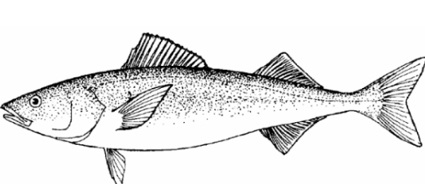
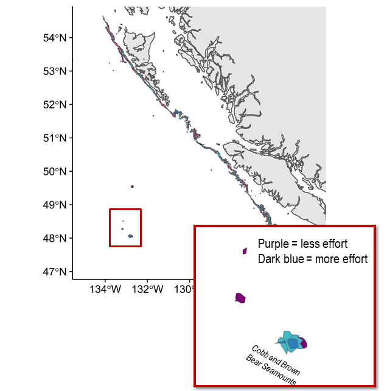
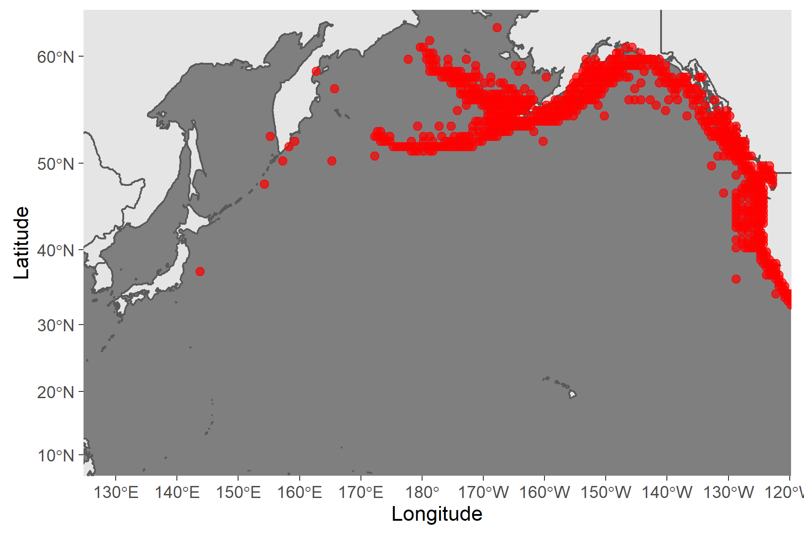

```{r setup, include=FALSE}
out_type <- knitr::opts_knit$get("rmarkdown.pandoc.to")
knitr::opts_chunk$set(warning = FALSE, mesNPAge = FALSE) 
options(tinytex.verbose = TRUE)

```

```{r, echo=FALSE}
out_type <- knitr::opts_knit$get("rmarkdown.pandoc.to")
```

```{r load package, include=FALSE}
library(rgdal)
library(rgeos)
library(sp)
library(ggplot2)
library(rfisheries)
library(tidyverse)
library(rnaturalearth)
library(sf)
library(readxl)
library(kableExtra)
library(GLDEX)
library(RColorBrewer)
library(gfdata)
library(zoo)
library(RODBC)
```


# Sablefish (*Anoplopoma fimbria*)

**Common names:** 

Black cod (USA & Canada)

ギンダラ, Gindara (Japan)

은대구, Eun-Daegu (Korea)


```{r picture, fig.cap="Figure 1. Sablefish (*Anaplopoma fimbria*).", echo=FALSE}



```
## Management

### Active NPFC Management Measures

The following NPFC conservation and management measures (CMM) pertain to this species: 

-   CMM 2019-06 For Bottom Fisheries and Protection of VMEs in the NE Pacific Ocean
-   CMM 2019-10 For Sablefish in the Northeastern Pacific Ocean

Available from https://www.npfc.int/active-conservation-and-management-measures

### Management Summary

The current management measure for sablefish specifies both catch and effort limits. The allowable catch of sablefish in the eastern portion of the Convention Area is based on a long-term mean of historical catches from seamounts by Canada. It allows for 34 mt to be landed each month for the 6 months of the fishing season (April to September). The fishery is also managed through input controls by only allowing a single vessel to fish in each month. The 1-3 Canadian vessels licensed to fish in the NPFC Convention Area are submitted to the NPFC Secretariat annually.

```{r manaagment table,message=FALSE,warning=FALSE,results="hide", echo=FALSE}
tabledat<-data.frame("Convention or Management Principle"=c("Biological reference point(s)", "Stock status","Catch limit","Harvest control rule", "Other"), Status=c("Unknown","Known","Known","Undefined","Known"),"Comment or Consideration"=c("Established for USA and Canada assessments","Healthy (in USA and Canada assessments)","Allowable catch of 34 mt per month (6 month season)","Established for USA and Canada assessments","Effort control (single vessel per month)"))

hcolor<-c("gray","green","green","grey","green")
```


```{r maketable,echo=FALSE}
tabledat%>%kbl(col.names=c("Convention or Management Principle","Status","Comment or Consideration"),caption = '<font size= "4">Table 1. Management Summary</font>')%>%kable_classic_2(full_width=F)%>%
    column_spec(2, color = "white",background = hcolor) 
#%>%

  #  footnote("\\\\textcolor{green}{OK}, \\\\textcolor{yellow}{Intermediate}, \\\\textcolor{red}{Not accomplished}, \\\\textcolor{gray}{Unknown}", title_format="bold",escape = F)
    
    
```

```{r get data,echo=FALSE,cache=TRUE}

#cnn<-odbcDriverConnect(paste("Driver={SQL Server};Server=DFBCV9TWVASP001;",
#                                 "Database=Seamount;Trusted_Connection=Yes",sep=""))
#sqlTables(cnn,tableType="TABLE")
#odbcClose(cnn)


GetSQLData <- function(strSQL,strDbName) {    # load function SQL SERVER 
  cnn <- odbcDriverConnect(paste("Driver={SQL Server};Server=DFBCV9TWVASP001;",
                                 "Database=",strDbName,";Trusted_Connection=Yes",sep=""))
  dat <- sqlQuery(cnn, strSQL)
  odbcClose(cnn)
  return(dat) 
}


sql       <- "select dbo.Report_Seamount_FE_Catch.* from Report_Seamount_FE_Catch"
catchdata <- GetSQLData(sql,"Seamount")

sql       <- "select dbo.Report_Seamount_Trips.* from Report_Seamount_Trips"
effortdata <- GetSQLData(sql,"Seamount")

seamounts<-c("BROWN BEAR SEAMOUNT","COBB SEAMOUNT","COWIE SEAMOUNT","DURGIN SEAMOUNT","EICKELBERG/WARWICK SEAMOUNTS","MILLER SEAMOUNT","MORTON SEAMOUNT","MURRAY SEAMOUNT","PATHFINDER SEAMOUNT","PRATT SEAMOUNT","SURVEYOR SEAMOUNT")

catch_all<-subset(catchdata,(catchdata$LOCALITY_NAME %in% seamounts))

effort_all<-subset(effortdata,(effortdata$LOCALITY_NAME %in% seamounts))

current_year1<-as.numeric(format(Sys.Date(), "%Y"))

```

```{r effort summary, echo=FALSE}


d1<-data.frame(Day=catchdata$START_DATE,Year=catchdata$YEAR)
d1$Day<-format(d1$Day,"%Y-%m-%d",usetz=FALSE)
d1<-unique(d1)
d1<-aggregate(Day~Year,data=d1,FUN="length")
d1<-subset(d1,d1$Year>1995)
d1<-rbind(d1,data.frame(Year=2021,Day=0),data.frame(Year=2022,Day=0))
current_year<-max(d1$Year)
d1$Day<-rollmean(d1$Day,k=3,fill=c("extend",NULL,0))

d1$Day[d1$Year==2021|d1$Year==2022]<-0
```


```{r catch summary,echo=FALSE}
speciesnames<-read.csv("C:/Users/rooperc/Desktop/NPFC/NPFC_Species_Summary/Sablefish/speciesgroups.csv",header=TRUE)
data_all<-merge(catch_all,speciesnames,by="SPECIES_COMMON_NAME",all.x=TRUE)
data_all<-rbind(data.frame(YEAR=data_all$YEAR,grouping=data_all$grouping,REPORT_CATCH_KG=data_all$REPORT_CATCH_KG),data.frame(YEAR=2021,grouping=unique(data_all$grouping),REPORT_CATCH_KG=0),data.frame(YEAR=2022,grouping=unique(data_all$grouping),REPORT_CATCH_KG=0))

c1<-aggregate(REPORT_CATCH_KG~YEAR+grouping,data=data_all,FUN="sum")
c1<-merge(c1,d1,by.x="YEAR",by.y="Year",all.x=TRUE)


c1$CPUE<-c1$REPORT_CATCH_KG/c1$Day
c1$CPUE[c1$Day==0]<-0
c1<-subset(c1,c1$YEAR>1995)
colnames(c1)<-c("Year","Species","Catch","Effort","CPUE")
c1<-subset(c1,c1$Species=="Sablefish")
c1$Catch<-rollmean(c1$Catch,k=3,fill=c("extend",NULL,0))
c1$CPUE<-rollmean(c1$CPUE,k=3,fill=c("extend",NULL,0))

c1$CPUE[c1$Year==2021|c1$Year==2022]<-0
c1$Catch[c1$Year==2021|c1$Year==2022]<-0
```


## Assessment

Although genetic and other evidence indicates there is a single stock of sablefish in the eastern North Pacific Ocean (including the NPFC Convention Area), three stock assessments are carried out in the three domestic jurisdictions Alaska (U.S.A.), British Columbia (Canada) and the U.S. West Coast (U.S.A.) where sablefish are harvested. 

Canada uses a management strategy evaluation (MSE) process to generate recommended harvest each year. Underlying the MSE is a statistical catch-at-age structured operating model (stock assessment model) that gets updated on a 3 – 5 year cycle (DFO 2016, DFO 2020). A new assessment by Canada is scheduled to be released in early 2023. The USA conducts two stock assessments (one for Alaska and one for the US West Coast). Both are conducted using age-structured models and are routinely updated. The current Alaska assessment (Goethel et al. 2021) and most recent USA West Coast assessment (Haltuch et al. 2019, Kapur et al. 2021) are available online. 

No stock assessment is conducted for the portion of the sablefish population found in the NPFC Convention area.

## Data
### Surveys
Canada has conducted two longline trap surveys in British Columbia waters. From 1990-2009 a standardized trap survey was conducted at set stations annually. From 2003 to the present DFO conducts a stratified random trap survey along the outer shelf and slope of the BC coast. Both of these surveys generate a fishery independent CPUE as well as biological data that is used in the assessment.  In Alaska, three survey indices are available for use in assessing the status of the sablefish population. There is a longline survey conducted at standard survey stations that provides a relative index of abundance. It has been conducted at depths from 200-1000 m annually since 1978 (cooperatively with Japan from 1978-1994). Bottom trawl surveys are conducted annually or biennially in the three main ecosystems in Alaska since 1982. The U.S. West Coast primarily uses fishery independent survey data from the west coast groundfish bottom trawl survey conducted from 2003-2018 over depths of 55 to ~1300 m as an index of sablefish abundance. The bottom trawl survey follows a random-stratified survey design with four vessels (in most years) conducting the survey annually. The trawl survey data is analyzed with the VAST model (Thorson 2019) to produce the index of abundance for sablefish. 

There is currently no survey conducted in the eastern NPFC Convention Area that captures or monitors sablefish populations. 


### Fishery

The Canadian high seas Sablefish fishery typically operates at 1-4 seamounts in the commission area (Cobb, Eickleberg, Warwick and Brown Bear seamounts). Historically other seamounts have been fished for sablefish both inside and outside Canada's EEZ. 

Fishing is conducted with longlined traps. Since 2014 a maximum of 3 vessels per year have been allowed to fish in NPFC waters. Historically the number of fishing vessels has averaged <3 per year (since 2008). The number of fishing days is the number of unique calendar days during which gear was set. The number of fishing days has averaged from about 25 to greater than 100, but in most years has averaged between 50 and 75 (Figure 2). 

No Canadian vessels have chosen to fish for Sablefish in the Convention Area since 2020. This is likely due to a combination of economics (high fuel prices and the large distance to the seamounts), the availability of quota in the domestic fishery which is easier to access and hesitancy about the requirements under the implementation of the new NPFC AIS policy. 

```{r keepincase,echo=FALSE,eval=FALSE}
In `r current_year` the number of unique vessels fishing in the convention area was `r length(unique(effort_all$VESSEL_NAME[effort_all$YEAR==current_year]))` and the number of fishing days was `r d1$Day[d1$Year==current_year]`.
```

Both Canada and the U.S.A. have large domestic fisheries that target sablefish inside their EEZ's. Sablefish is also captured as bycatch in domestic trawl fisheries in Canada and the U.S.A.

```{r effort, echo=FALSE,warning=FALSE,fig.cap="Figure 2. Fishing effort (in number of fishing days) for the Sablefish longline trap fishery conducted in NPFC waters (1996-present).Data are averaged across 3 years to comply with data privacy restrictions."}

# d1<-data.frame(Day=catchdata$START_DATE,Year=catchdata$YEAR)
# d1$Day<-format(d1$Day,"%Y-%m-%d",usetz=FALSE)
# d1<-unique(d1)
# d1<-aggregate(Day~Year,data=d1,FUN="length")
# d1<-subset(d1,d1$Year>1995)
# d1<-rbind(d1,data.frame(Year=2021,Day=0))

ggplot(d1)+geom_bar(aes(x=as.factor(Year),y=Day,fill=as.factor(Year)),stat="identity")+xlab(element_blank())+ylab("Fishing days")+theme(legend.position="",axis.text.x = element_text(angle=90,vjust = 0.5, hjust=0.5,size=10),panel.grid=element_blank(),panel.background = element_rect("white"),axis.line.x=element_line(),axis.line.y=element_line())+scale_y_continuous(expand=c(0,0))

```

Output controls limit the amount of fish that can be landed during a trip. Authorized vessels are subject to monthly vessel limits of 34 mt of Sablefish, 2.3 mt of combined Rougheye and Blackspotted rockfish and 0.45 mt of other rockfish, sole and flounder (all in round weight). These measures have been in place since 2011.


Catches of Sablefish from NPFC region seamounts has ranged from an average of about 10 mt per year in 2005-2008 to about 67 mt in 2017 (Figure 3). Average annual catches were relatively low from 2002 to 2016 at NPFC seamounts and then  increased in 2017-2018, with a decline to low levels in the last years. This increase in part probably reflects shifting effort due to closures of seamounts within Canada's EEZ. An examination of coastwide shifts in the spatial pattern of fishing effort showed that fishing effort has become concentrated on Cobb Seamount, with increasing effort in shallower waters relative to the past (Figure 4). 

There was no fishing effort at seamounts during 2021 or 2022 resulting in no catch.

```{r keepincase2,echo=FALSE,eval=FALSE}
The catch of sablefish from the Convention Area in `r current_year` was `r round(c1$Catch[c1$Year==current_year&c1$Species=="Sablefish"]/1000,3)` mt.
```
```{r catchSablefish, echo=FALSE,warning=FALSE,fig.cap="Figure 3. Landings of sablefish in the Canadian Sablefish fishery in NPFC region (1996-present).Data are averaged across 3 years to comply with data privacy restrictions."}
ggplot(c1[c1$Species=="Sablefish",])+geom_bar(aes(x=as.factor(Year),y=Catch/1000,fill=as.factor(Year)),stat="identity")+
  scale_fill_viridis_d("Years",option="plasma")+xlab(element_blank())+theme(legend.position="",axis.text.x = element_text(angle=90,vjust = 0.5, hjust=0.5,size=10),panel.grid=element_blank(),panel.background = element_rect("white"),axis.line.x=element_line(),axis.line.y=element_line())+scale_y_continuous(expand=c(0,0))+ylab("Catch (mt)")
```


```{r effortSablefish, echo=FALSE,warning=FALSE,fig.cap="Figure 4. Relative change in spatial distribution of effort for Sablefish trap fishery from 2010-2017 to 2018-2019. Inset shows seamounts in the NPFC Convention Area."}

```

Catch per unit of effort (mt/fishing days) for Sablefish has been increasing over the last 10 years (Figure 5), averaging `r round(mean(c1$CPUE[c1$Species=="Sablefish"],na.rm=TRUE)/1000,2)` mt/fishing day (CV = `r round(100*sd(c1$CPUE[c1$Species=="Sablefish"],na.rm=TRUE)/mean(c1$CPUE[c1$Species=="Sablefish"],na.rm=TRUE),0)`%). CPUE was not calculated in `r current_year`, but has generally been increasing since 2012.

```{r catchperuniteffortfigure,echo=FALSE,fig.cap="Figure 5. Catch per unit of effort for Canadian Sablefish fishery in NPFC region. Data are averaged across 3 years to comply with data privacy restrictions."}

ggplot(c1[c1$Species=="Sablefish",])+geom_bar(aes(x=as.factor(Year),y=CPUE/1000,fill=as.factor(Year)),stat="identity")+
  scale_fill_viridis_d("Years",option="viridis")+xlab(element_blank())+theme(legend.position="",axis.text.x = element_text(angle=90,vjust = 0.5, hjust=0.5,size=10),panel.grid=element_blank(),panel.background = element_rect("white"),axis.line.x=element_line(),axis.line.y=element_line())+scale_y_continuous(limits=c(0,1),expand=c(0,0))+ylab("CPUE (mt per fishing day)")
```


### Biological collections

Under the seamount fishing protocol, 5 randomly selected fish per trip are saved by the vessel for sampling when it returns to port. These sablefish are sampled for length, weight and sex. Otoliths are collected for age estimation. 

In 2020 due to COVID 19 restrictions, there were no biological samples collected from Sablefish captured in the Convention Area. Historical data will be provided to the NPFC Science Committee, when and as required, in conjunction with the NPFC’s Interim Guidance for Management of Scientific Data Used in Stock Assessments. 


```{r get biological,eval=FALSE,echo=FALSE}
library(DBI)
if(!(require(RODBC))) install.packages("RODBC") 
path<-"//DFBCV9TWVASP001/Shares$/ChrisR/Seamount_bio_data/"

# ------------SQL SERVER LOAD-------------------------

GetSQLData <- function(strSQL,strDbName) { 
   require(RODBC)   
   cnn <- odbcDriverConnect(paste("Driver={SQL Server};Server=DFBCV9TWVASP001;",
        "Database=",strDbName,";Trusted_Connection=Yes",sep=""))
   dat <- sqlQuery(cnn, strSQL)
   odbcClose(cnn)
   return(dat) 
}
	
View(sqlTables(cnn,tableType="TABLE"))
View(sqlColumns(cnn,"SABLEFISH_BIO_CATCH"))

  biodata<- paste("select YEAR, LOCALITY_NAME ",
                      " from   GFBIO1_SPECIMEN_LWSMA455 ",
                      " where  (YEAR > 2018) ", sep="")
  
  
   biodata<- paste("select YEAR, SEAMOUNT_IND, TRIP_ID, GEAR_DESC, SPECIES_CODE, ",
                      " SPECIMEN_SEX_CODE, MATURITY_CODE, SPECIMEN_AGE, Fork_Length, ",
                      " Round_Weight, MAJOR_STAT_AREA_CODE, MINOR_STAT_AREA_CODE, LOCALITY_CODE ",
                      " from   GFBIO_SABLEBIO_VW ",
                      " where  (YEAR > 2017) AND (SEAMOUNT_IND = 1) ", sep="")

   description<- GetSQLData(biodata,"Sablefish")
 #  write.table(description, file = paste(path,"Seamount_biodata.csv",sep=''),row.names=FALSE, na="",col.names=TRUE, sep=",")


# trips<-as.numeric(unique(catch_all$TRIP_ID))
# biology<-get_commercial_samples(c("sablefish","rougheye/blackspotted rockfish complex"))
# biology_all<-subset(biology,(biology$trip_id %in% trips))
# biology_2020<-subset(biology_all,biology_all$year==2020)

```

Domestic fisheries in the U.S.A. and Canada also collect biological data. Data including length, weight and sex are collected from the scientific survey and by observers and dockside samplers from the commercial fisheries. Otoliths for estimating fish ages are also collected from both the surveys and the fisheries. 


```{r data table,message=FALSE,warning=FALSE,results="hide", echo=FALSE}
tabledat<-read.csv("sable_datatable.csv",header=TRUE)
```

```{r makedatatable,echo=FALSE}
tabledat%>%kbl(caption = '<font size= "4">Table 2. Data availability from Members regarding sablefish</font>')
    
```

## Special Comments

None

## Biological Information

### Distribution
Sablefish are widely distributed throughout the Pacific Ocean from northern Mexico to the Gulf of Alaska, westward to the Aleutian, and northward into the Bering Sea (Figure 6; Wolotira et al. 1993). They are also found along the western margin of the Pacific Ocean from southern Japan through the Kamchatka Peninsula and northward into the Bering Sea. Adult sablefish occur along the continental slope, shelf gullies, and in deep fjords, generally at depths greater than 200 m. Juvenile sablefish spend their first two to three years on the continental shelf at shallower depths. Spawning is generally in the winter and spring (October-April) and occurs near the shelf break. Spawning timing generally occurs earlier in the south (October-February in California) and later in the north (January – April in Alaska). Eggs are found at depth and larvae are found in surface waters (Shotwell et al. 2020).  

### Life history
Larval sablefish feed on zooplankton prey. Juveniles shift from pelagic to benthic prey including fishes and invertebrates. Adults consume mostly benthic fishes and invertebrates. Sablefish mature at 4 to 5 years. In the eastern Pacific, Sablefish have traditionally been thought to form two populations based on differences in growth rate, size at maturity, and tagging studies. The northern population inhabits Alaska and northern British Columbia waters and the southern population inhabits southern British Columbia, Washington, Oregon, and California waters, with mixing of the two populations occurring off southwest Vancouver Island and northwest Washington. However, recent genetic work by Jasonowicz et al. (2017) found no population sub-structure throughout their range along the US West Coast to Alaska, and suggested that observed differences in growth and maturation rates may be due to phenotypic plasticity or are environmentally driven. Tagging evidence suggests that the sablefish inhabiting seamounts in the NPFC Convention Area are not distinct from the coast wide sablefish population.

```{r MapTheDistribution,message=FALSE,warning=FALSE,results="hide", echo=FALSE}
#IMPORT DISTRIBUTION POINTS (THESE ARE A PLACEHOLDER FROM AQUAMAPS)
dist_points<-read.csv("1639365571.csv",skip=7,header=TRUE)
data1<-data.frame(Lon=dist_points$Center.Long,Lat=dist_points$Center.Lat)

#IMPORT THE BASEMAP AND TRANSFORM TO A NICER PROJECTION FOR THE NORTH PACIFIC
bg = ne_countries(scale = "medium",  returnclass = "sf")
bg1<-st_transform(bg,3832)

#TRANSFORM THE POINTS TO THE SAME PROJECTION AND ADD THEM TO THE DATA SET
data2<-project(cbind(data1$Lon,data1$Lat),"+proj=merc +lon_0=150 +k=1 +x_0=0 +y_0=0 +datum=WGS84 +units=m +no_defs")
data1$LonP<-data2[,1]
data1$LatP<-data2[,2]
#data1<-subset(data1,data1$Lon>0)

#MAKE A SET OF BOUNDARIES TO USE AS THE PLOTTING RANGE (LIMITS ON LONGITUDE AND LATITUDE)
data3<-data.frame(cbind(c(130,235),c(62,10)))
data3<-proj4::project(data3,"+proj=merc +lon_0=150 +k=1 +x_0=0 +y_0=0 +datum=WGS84 +units=m +no_defs")

#PLOT THE ENTIRE SET WITH THE MAP AS THE BACKGROUND
p<-ggplot()+
  #basemap
  geom_sf(data = bg1)+
  coord_sf(xlim = range(data3$x, na.rm = TRUE), 
           ylim = range(data3$y, na.rm = TRUE), 
           expand = TRUE)+
  
  # add points
  geom_point(data = data1, 
             aes(x=LonP,y=LatP),
             alpha = 0.7, shape=20, col="red",size = 3)+
  
  # formatting
  theme_dark()+xlab("Longitude")+ylab("Latitude")+
  scale_x_continuous(breaks = seq(130,240,10)) +
  theme(panel.grid = element_blank())
png("Figures/distmap.png",height=4,width=6,unit="in",res=300)
print(p)
dev.off()
```

```{r picture4, fig.cap="Figure 6. Map of distribution of sablefish in the North Pacific.", echo=FALSE}



```

## Literature cited

DFO. 2016. A revised operating model for Sablefish (Anoplopoma fimbria) in British Columbia, Canada. DFO Can. Sci. Advis. Sec. Sci. Advis. Rep. 2016/015.

DFO. 2020. Evaluating the robustness of candidate management procedures in the BC Sablefish (Anoplopoma fimbria) fpshery for 2019-2020. DFO Can. Sci. Advis. Sec. Sci. Resp. 2020/025.

Goethel, D.R., Hanselman, D.H., Rodgveller, C.J., Echave, K.B., Williams, B.C., Shotwell, S.K., Sullivan, J.Y., Hulson, P.F., Malecha, P.W., Siwicke, K.A., and Lunsford, C.R. 2020. Assessment of the sablefish stock in Alaska. In “Stock Assessment and Fishery Evaluation Report for the Groundfish Resources of the GOA and BS/AI.” Anchorage, AK: North Pacific Fishery Management Council. 

Jasonowicz, A. J., F. W. Goetz, G. W. Goetz, and K. M. Nichols. 2017. Love the one you’re with: genomic evidence of panmixia in the sablefish (Anoplopoma fimbria). Can. J. Fish. Aquat. Sci. 74:377-387.

Kapur, M.S., Lee, Q., Correa, G.M., Haltuch,M., Gertseva, V. and Hamel, O.S. 2021. DRAFT Status of sablefish (Anaplopoma fimbria) along the US West Coast in 2021. Pacific Fisheries Management Council, Portland, Oregon, 196 p.

Shotwell, K., Goethel, D.R., Deary, A., Echave, K., Fenske, K., Fissel, B., Hanselman, D., Lunsford, C., Siwicke, K., and Sullivan, J. 2020. Ecosystem and socioeconomic profile of the sablefish stock in Alaska. In “Stock Assessment and Fishery Evaluation Report for the Groundfish Resources of the GOA and BS/AI.” Anchorage, AK: North Pacific Fishery Management Council. 

Thorson, J. 2019. Guidance for decisions using the Vector Autoregressive Spatio-Temporal (VAST) package in stock, ecosystem, habitat and climate assessments. Fisheries Research 210: 143–161. doi:10.1016/j.fishres.2018.10.013.

Wolotira, R. J. J., T. M. Sample, S. F. Noel, and C. R. Iten. 1993. Geographic and bathymetric distributions for many commercially important fishes and shellfishes off the west coast of North America, based on research survey and commercial catch data, 1912-1984. NOAA Tech. Memo. NMFS-AFSC-6. 184 pp.

