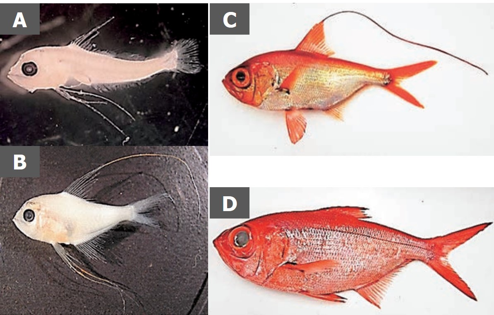
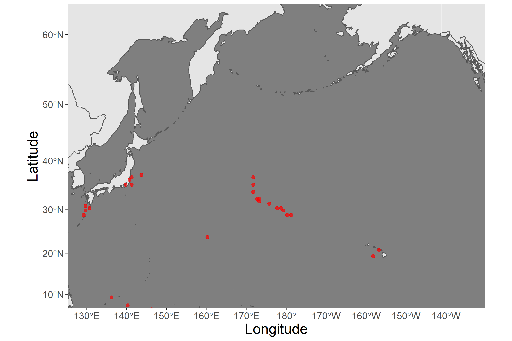
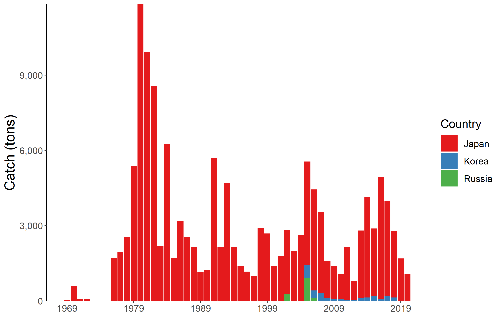

```{r setup, echo=FALSE}
out_type <- knitr::opts_knit$get("rmarkdown.pandoc.to")
knitr::opts_chunk$set(warning = FALSE, message = FALSE) 
options(tinytex.verbose = TRUE)
```

```{r, echo=FALSE}
out_type <- knitr::opts_knit$get("rmarkdown.pandoc.to")
```

```{r load package, include=FALSE}
library(rgdal)
library(rgeos)
library(sp)
library(ggplot2)
library(rfisheries)
library(tidyverse)
library(rnaturalearth)
library(sf)
library(readxl)
library(kableExtra)
library(GLDEX)
library(RColorBrewer)
```

# Splendid Alfonsino (*Beryx splendens*)

**Common names:** (Chinese); (English); Splendid Alfonsino (Japanese); (Korean); (Russian)

## Biological Information

Global distribution ranges from tropical to temperate oceans. Historical catch records in the Emperor Seamount suggest the distribution from Nintoku (45 °N) to Hancock (30 °N). Settlement occurs following a certain period of the pelagic life stage. Adults show a vertical distribution from 200 to 800 m with diel vertical migration, feeding on crustaceans, cephalopods, and fish during the night. Limited information is available for recruitment and reproduction processes in the Emperor Seamounts, whereas the population in the Japanese coast shows 4--5 years to sexually mature and spawning occurs during summer.

```{r picture, fig.cap="**Figure 1: Photographs of Beryx splendens.** <br>A) postlarva, B) juvenile, C) young, D) adult (from Watari et al. 2016)</br>", out.width="70%", out.height="70%", fig.align='center', echo=FALSE}



```

```{r MapTheDistribution,message=FALSE,warning=FALSE,results="hide", echo=FALSE}
#IMPORT DISTRIBUTION POINTS (THESE ARE A PLACEHOLDER FROM AQUAMAPS)
download.file("https://www.aquamaps.org/CSV/1623909682.csv", destfile="SA_Distribution.csv",mode="wb", quiet = FALSE)
dist_points<-read.csv("SA_Distribution.csv",skip=7,header=TRUE)
data1<-data.frame(Lon=dist_points$Center.Long,Lat=dist_points$Center.Lat)

#IMPORT THE BASEMAP AND TRANSFORM TO A NICER PROJECTION FOR THE NORTH PACIFIC
bg = ne_countries(scale = "medium",  returnclass = "sf")
bg1<-st_transform(bg,3832)

#TRANSFORM THE POINTS TO THE SAME PROJECTION AND ADD THEM TO THE DATA SET
data2<-project(cbind(data1$Lon,data1$Lat),"+proj=merc +lon_0=150 +k=1 +x_0=0 +y_0=0 +datum=WGS84 +units=m +no_defs")
data1$LonP<-data2[,1]
data1$LatP<-data2[,2]

#MAKE A SET OF BOUNDARIES TO USE AS THE PLOTTING RANGE (LIMITS ON LONGITUDE AND LATITUDE)
data3<-data.frame(cbind(c(130,225),c(62,10)))
data3<-proj4::project(data3,"+proj=merc +lon_0=150 +k=1 +x_0=0 +y_0=0 +datum=WGS84 +units=m +no_defs")

#PLOT THE ENTIRE SET WITH THE MAP AS THE BACKGROUND
p<-ggplot()+
  #basemap
  geom_sf(data = bg1)+
  coord_sf(xlim = range(data3$x, na.rm = TRUE), 
           ylim = range(data3$y, na.rm = TRUE), 
           expand = TRUE)+
  
  # add points
  geom_point(data = data1, 
             aes(x=LonP,y=LatP),
             alpha = 0.7, shape=20, col="red",size = 3)+
  
  # formatting
  theme_dark()+xlab("Longitude")+ylab("Latitude")+
  scale_x_continuous(breaks = seq(130,230,10)) +
  theme(axis.title = element_text(size = 18),
        axis.text.x = element_text(size = 12),
        axis.text.y = element_text(size = 12),
        panel.grid = element_blank())
png("Figures/SA_DistributionMap.png",height=6,width=9,unit="in",res=300)
print(p)
dev.off()
```

```{r picture2, fig.cap="**Figure 2: Known distribution of Beryx splendens.** <br>Points indicate observation data from original sources (AquaMaps 2019, October)</br>", out.width="80%", out.height="80%", fig.align='center', echo=FALSE}


```

## Fishery
Since the discovery of large populations of North Pacific Armorhead (NPA) in the Emperor Seamount in the late 1960s, SA has been exploited as an alternative resource to NPA due to the large temporal fluctuation of the NPA population. The main fishing methods are bottom trawls and gillnets.

Historical catch record (Figure 3) shows the highest catch proportion by Japan, followed by Korea and Russia. Russia terminated their fishery nearly a decade ago. Fishing pressure somewhat reflects the recruitment condition of NPA. In 2010 and 2012, when high recruitment of NPA occurred, the annual catch decreased below 1,000 tons, whereas it increased up to 4,000 tons ever since then.

Size composition analysis from the catch data by Japanese trawlers suggests the substantial decrease in size of fish in catches over the past decade, raising the concern about recruitment overfishing.

```{r getcatchdata,message=FALSE,warning=FALSE,results="hide", echo=FALSE}
#FAO Data
#species = rfisheries::of_species_codes()
#species %>% 
#  filter(str_detect(scientific_name %>% tolower(), pattern = "sardinops"))

scientific.name<-"Beryx splendens"
species.info<-subset(of_species_codes(), scientific_name == scientific.name)
species.code<-c(species.info$a3_code)

FAO_catch<-NULL
for(i in 1:length(species.code)){
temp1<-rfisheries::of_landings(species = species.code[i])
FAO_catch<-rbind(FAO_catch,temp1)}
FAO_catch<-data.frame(Year=FAO_catch$year,Catch=FAO_catch$catch,Member="FAO - historical")

#NPFC DATA
download.file("https://www.npfc.int/system/files/2021-04/NPFC-2021-AR-Annual%20Summary%20Footprint%20-%20Bottom%20Fisheries.xlsx", destfile="SA_catch.xlsx",mode="wb", quiet = FALSE)

NPFC_catch<-data.frame(read_xlsx("SA_catch.xlsx",sheet="Catch Summary",col_types = "numeric", skip=134)) %>% 
  rename(Year=1,Japan_Trawl=2,Japan_Gillnet=3,Korea_Trawl=4,Korea_Longline=5,Russia_Trawl=6,Russia_Longline=7,Total=8) %>% 
  mutate(Japan=Japan_Trawl+Japan_Gillnet,Korea=Korea_Trawl+Korea_Longline,Russia=Russia_Trawl+Russia_Longline) %>% 
  select(Year,Japan:Russia) %>% 
  filter(Year>0)

NPFC_catch<-data.frame(pivot_longer(NPFC_catch,Japan:Russia,names_to="Member",values_to="Catch"))
minyear<-min(NPFC_catch$Year,na.rm=TRUE)
FAO_catch<-subset(FAO_catch,Catch>0)
catch<-rbind(FAO_catch,NPFC_catch)
catch$Member<-factor(catch$Member,levels=c("FAO - historical","Korea","Japan","Russia"))

p1<-ggplot(catch)+geom_bar(aes(x=Year,y=Catch,fill=Member),stat="identity",position="stack")+
  ylab("Catch (tons)")+xlab("") + scale_x_continuous(breaks = seq(min(catch$Year,na.rm=TRUE),max(catch$Year,na.rm=TRUE),10))+
  scale_y_continuous(expand=c(0,0))+scale_fill_brewer(palette="Set1")+
       theme_bw() +
     theme(axis.title = element_text(size = 18),
           axis.text.x = element_text(size = 12),
           axis.text.y = element_text(size = 12),
           axis.line = element_line(colour = "black"),
           panel.grid.major = element_blank(),
           panel.grid.minor = element_blank(),
           panel.border = element_blank(),
           panel.background = element_blank(),
           legend.justification="center",
           legend.key.size = unit(0.8, "cm"),
           legend.title = element_text(size = 15),
           legend.text = element_text(size = 12))

png("Figures/SA_Catch.png",width=9, height=6,units="in",res=300)
print(p1)
dev.off()
```

```{r picture3, fig.cap="**Figure 3: Catch trends of splendid alfonsino over the past two decades.** The annual amounts of catch for alfonsino by each Member are shown by the bar plot.", out.width="80%", out.height="80%", fig.align='center', echo=FALSE}



```


```{r effort data,message=FALSE,warning=FALSE,results="hide", echo=FALSE}
NPFC_effort<-data.frame(read_xlsx("SA_catch.xlsx",sheet="Vessel Summary",skip=28,col_types='numeric')) %>% 
  mutate_all(funs(ifelse(is.na(.),0,.))) %>% 
  mutate(Japan=Japan...2+Japan...9, Korea=Korea...3+Korea...6, Russia=Russia...4+Russia...7+Russia...10)

NPFC_effort<-data.frame(pivot_longer(NPFC_effort,Japan:Russia,names_to="Member",values_to="Effort")) %>% 
  select(-(Japan...2:Russia...10))

p1<-ggplot(NPFC_effort)+geom_bar(aes(x=Year,y=Effort,fill=Member),stat="identity",position="stack")+
  ylab("Effort (Days fished)")+xlab("") + scale_x_continuous(breaks = seq(2001,max(NPFC_effort$Year),5))+
  scale_y_continuous(expand=c(0,0))+scale_fill_brewer(palette="Dark2")+
       theme_bw() +
     theme(axis.line = element_line(colour = "black"),
           panel.grid.major = element_blank(),
           panel.grid.minor = element_blank(),
           panel.border = element_blank(),
           panel.background = element_blank(),
           legend.position="right")

png("Figures/SA_Effort.png",width=9, height=6,units="in",res=300)
p1
dev.off()
```


```{r picture1, fig.cap="**Figure 4. Historical fishing effort for Splendid Alfonsino.**", out.width="70%", out.height="70%", fig.align='center', echo=FALSE}

knitr::include_graphics("Figures/SA_Effort.png")

```

## Assessment

There are no biomass estimates available for SA in NPFC waters.

An age- or length-structured stock assessment may be feasible given the life history SA (citation for more information). Surplus production models developed by Japan in 2008 showed that the average fishing mortality is 20--28 % higher than the MSY level. This analysis, however, remains unreliable as the estimated CPUE is biased due to target shifts between NPA and SA and the estimated intrinsic population growth rate parameter was too high for long-lived deep-sea fish.

Data limited approaches, such as YPR or SPR analysis that do not require detailed resource parameters or fishing data, should be explored in the future.

## Management

**Active Management Measures**

The following NPFMC conservation and management measures pertain to this species:

- CMM 2019-05 For Bottom Fisheries and Protection of VMEs in the NW Pacific Ocean

- CMM 2019-06 For Bottom Fisheries and Protection of VMEs in the NE Pacific Ocean

Available from <https://www.npfc.int/active-conservation-and-management-measures>


```{r manaagment table,message=FALSE,warning=FALSE, results='asis', echo=FALSE}
MngmtTable<-data.frame(
  row.names = c("Biological reference points", "Stock status","Catch limit","Harvest control rule", "Other"), 
  Status = c("Not accomplished", "Unknown", "Intermediate", "Not accomplished", "Intermediate"),
  Comment = c("Not established","Status determination criteria not established","Recommended catch, effort limits","Not established","No expansion of fishing beyond established areas"))

cols <- brewer.pal(9, "Set1")

switch (out_type,
  html = MngmtTable %>% 
    kable(caption = '<font size= "5">Management Summary</font>')%>% 
    kable_paper(full_width=F)%>%
    row_spec(0, bold = T, color = "white")%>% 
    column_spec(1, bold = T) %>% 
    column_spec(2, background = c(cols[1], cols[9], cols[5], cols[1], cols[5]), color = "white") %>% 
    kable_styling(font_size = 18, bootstrap_options = c("basic", "striped")
))
 
```

Currently, there is no accepted harvest control for this species.

In 2016, the interim management measures were implemented, which includes limiting the fishing effort to the 2007's catch level, prohibiting fisheries from November to December (which corresponds to the spawning season for NPA) and not allowing fisheries in C-H Seamount and the southeastern part of Koko Seamount (for the protection of VMEs).

In 2019, an adaptive management plan was additionally adopted, which includes the regulation of the mesh size (trawl: \> 10 cm, gillnet: 12 cm) to protect juvenile fish. Still, this measure is insufficient as the substantial catch of young fish has been reported by trawlers even after being implemented.

## Data Summary

```{r data table, echo=FALSE}
options(knitr.kable.NA = '')

DataTable <-data.frame(read_xlsx("SA_Species_Summary_Data.xlsx"))

switch (out_type,
  html = DataTable %>% 
    kbl(col.names = c("Data type", "Source", "Years available", "Comment"))%>% 
  kable_paper(full_width=F) %>% 
    row_spec(0, bold = T, color = "white") %>% 
    column_spec(3, width = "15em") %>% 
    kable_styling(font_size = 15, bootstrap_options = c("basic", "striped"))
)
```


## References

AquaMaps 2019, October (add citation for map here)

FAO. (2016). Global review of Alfonsino (Beryx spp.) their fisheries, biology, and management. In *Food and Agriculture Organization of the United Nations* (Vol. 1084, Issue 1084). <http://www.fao.org/3/a-i5336e.pdf>

Sawada, K., Nishida, K., Yonezaki, S., Kiyota, M., & Review, M. (2018). *Review of biology and fisheries of splendid alfonsino Beryx splendens , especially in the Emperor seamounts area by April 2018 This paper may be cited in the following manner: NPFC-2018-SSC BF01-WP03 Review of biology and fisheries of splendid alfonsino*.

Watari et al. 2016 (add citation information here)
